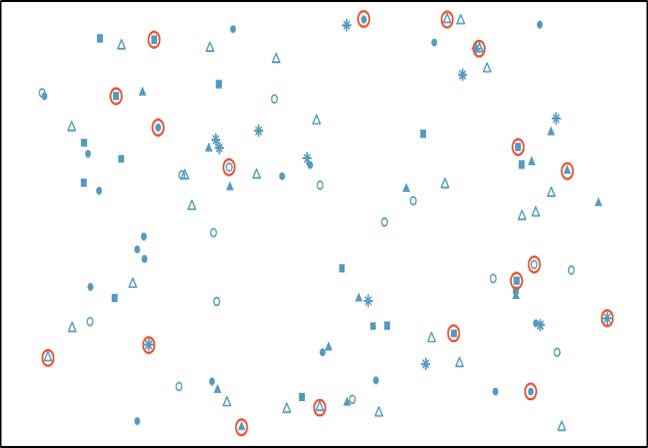

---
output:
  html_document: default
  pdf_document: default
---
# Lecture 17 {-}

&nbsp;


```{r, include=FALSE}

library(tidyverse)

```

## Sampling Methods {-}

When working on a research project/study, you always have a specific population of interest that you would like to target. For instance, if you want to do some research on everyone in North America, then all people living in North America will be the population of interest. Or, suppose you work for a manufacturing plant and you are interested in examining the quality of valves that this manufacturing plant produces. Then, all valves produced by this manufacturing plant will be your population of interest. In general, a **population** is the complete set of all objects or people of interest. In other words, it is a totality of the individuals of objects that are of interest in a statistical study. 

Typically, you are interested in assessing certain characteristics of a population. These characteristics are summary values calculated from a population and are called **population parameters**. It is normally impractical to study a whole population to deterministically calculate population parameters, because we would need to observe every individual/object in the population and this procedure has some limitations (for instance, it might take too long to complete the study, the research costs are too high, or it might destroy all items in the population in the process of measurement).

Thus, instead of measuring/examining every element in a population, we take a **sample**. A sample is a subset of the elements that is often a small fraction of the overall population. For instance, instead of surveying all people in North America, we will take a sample of 10,000 people. Or, instead of examining all valves produced by the manufacturing plant, we will take a sample of 300 valves. Characteristics describing a sample are called **sample statistics**. We then use a sample statistic to estimate the corresponding population parameter. 

In this lecture, we will discuss different **sampling methods**. As you already understand, **sampling** is a method that allows researchers to infer information about a population based on results from a subset of the population, without having to investigate every individual. Sampling is an essential part of any research project. The right sampling method can make or break the validity of your research, and it’s essential to choose the right method for your specific question.

If a sample is to be used, by whatever method it is chosen, it is important that the individuals/objects selected are **representative** of the whole population. The best way to ensure a sample is representative of the population is to ensure all the observations that comprise it were selected **at random**. Representative samples allow us to generalize the results from the sample to the population.

There are several different sampling techniques available, and they can be subdivided into two groups: **probability sampling** and **non-probability sampling**. In probability (random) sampling, you start with a complete sampling frame of all eligible individuals from which you select your sample. In this way, all eligible individuals have a chance of being chosen for the sample, and you will be more able to generalise the results from your study. Probability sampling methods tend to be more time-consuming and expensive than non-probability sampling.

In non-probability (non-random) sampling, you do not start with a complete sampling frame, so some individuals have no chance of being selected. Consequently, you cannot estimate the effect of sampling error and there is a significant risk of ending up with a non-representative sample which produces non-generalisable results. However, non-probability sampling methods tend to be cheaper and more convenient, and they are useful for exploratory research and hypothesis generation.

&nbsp;

### Probability Sampling Methods {-}

Consider the salaries of Major League Baseball (MLB) players, where each player is a member of one of 30 teams. We would like to know what an average salary of MLB player is. In this example, all MLB players are a population of interest and their average salary is a population parameter. Now you know that you have to take a sample from the population of all MLB players in order to estimate their average salary. But how can we do that? 

Below we discuss different sampling methods that you can utilize.


#### Simple Random Sampling {-}

A **Simple Random Sample (SRS)** from a population is one in which each possible sample of that size has the same chance of selection. In other words, every member of the population has the exact same chance of being selected into the sample. In this case each individual is chosen entirely by chance. SRS is a good way of ensuring that your sample is representative of the population it is chosen from.

One way of obtaining a random sample is to give each individual in a population a number, and then use a table of random numbers to decide which individuals to include. Or, for instance, in our example we might write last year’s salary for each of the MLB players on a scrap of paper and randomly  jumble them in a bag. Thereafter, we could blindly pull a sample of these paper scraps out of the bag.



A specific advantage of SRS is that it is the most straightforward method of probability sampling. A disadvantage of simple random sampling is that you may not select enough individuals with your characteristic of interest, especially if that characteristic is uncommon.


&nbsp;

#### Stratified Sampling {-}

In this method, the population is first divided into subgroups (or **strata**) who all share a similar characteristic. Thereafter, a simple random sample (SRS) is taken from each stratum. It is used when we might reasonably expect the measurement of interest to vary between the different subgroups, and we want to ensure representation from all the subgroups. This method works best when there is a lot of variability **between** each stratum, but not much variability **within** each one.

In our example, instead of randomly sampling from the population of MLB salaries blindly, we could categorize (stratify) the salaries according to the position played by each player (pitcher, short-stop, catcher, etc.) Ideally, all the observations in each stratum are similar with respect to the outcome of interest.


Stratified sampling improves the accuracy and representativeness of the results by reducing sampling bias. However, it requires knowledge of the appropriate characteristics of the sampling frame (the details of which are not always available), and it can be difficult to decide which characteristic(s) to stratify by.

&nbsp;


#### Clustered Sampling {-}

In a clustered sample, subgroups of the population are used as the sampling unit, rather than individuals. The population is divided into subgroups, known as clusters, which are randomly selected to be included in the study. This method works best when there is **a lot** of variability within each cluster and **not a lot** of variability between each cluster.

In our example, we could cluster players by their teams, then randomly select a few of these clusters (teams) and then observe all the players in the chosen clusters.


Cluster sampling can be more efficient than simple random sampling, especially where a study takes place over a wide geographical region. Disadvantages include an increased risk of bias, if the chosen clusters are not representative of the population, resulting in an increased sampling error.


&nbsp;


#### Systematic Sampling {-}

In systematic sampling, individuals are selected at regular intervals from the sampling frame. The intervals are chosen to ensure an adequate sample size. Specifically, we randomly select a fixed starting point and then select every **_k_**-th observation in the ordered population to be in the sample (where **_k_** is the population size divided by the desired sample size). Systematic sampling works well when your population can be ordered in some way. It is **similar** to SRS, since every member of the population has an equal chance of being chosen. But it **is not the same as** SRS, since not every possible sample has the same probability of being selected. 

In our example, we can first order all MLB players by their last names. Then we would choose a random number between 1 and 15 as a starting point, and then select every 15-th person on the list to be in our sample.
 


Systematic sampling is often more convenient than simple random sampling, and it is easy to administer. However, it may also lead to bias, for example if there are underlying patterns in the order of the individuals in the sampling frame, such that the sampling technique coincides with the periodicity of the underlying pattern.


&nbsp;


### Non-Probability Sampling Methods{-}

#### Convenience Sampling {-}

Convenience sampling is perhaps the easiest method of sampling, because participants are selected based on availability and willingness to take part. Useful results can be obtained, but the results are prone to significant bias, because those who volunteer to take part may be different from those who choose not to (volunteer bias), and the sample may not be representative of other characteristics, such as age or sex.

Note: volunteer bias is a risk of all non-probability sampling methods. Thus, while it’s possible to get interesting information from a convenience sample, they are rarely (if ever) representative of a larger population.

In our example, we could browse websites and collect salaries of several MLB players that are publicly available.


&nbsp;

### Practice Problems: Guess the Sampling Method{-}


1. A third-grade teacher has a bag of craft sticks. Each stick has the name of one student in the class written on it. To select three students to help with a school assembly the teacher reaches into the bag without looking and chooses 3 sticks.

2. A researcher studying short-term memory believes that age plays a role. From a large group of people who have agreed to be part of a research study, the researcher randomly selects 40 people over the age of 50, 40 people between the ages of 30 and 50, and 40 people who are between the ages of 15 and 30.

3. Marcus and Caroline are collecting data about the price of soda and candy bars at service stations. They collect the information from the service stations that are close enough to their house to ride their bikes to.

4. Columbia University housing officials want to collect in-depth information about student life on campus. They create a list of every floor of every dorm on campus, and then randomly select 4 floors from the list and survey every resident on those 4 floors.

5. To select a sample of 12 Kentucky Derby winning horses, we arrange the winner by year, select a random number between 1 and 10, and then include that horse and every 10th horse on the list.

6. Motivated by a student who died from binge drinking, the administration at a university conducts a study of student drinking by randomly selecting 10 different classes being taught this semester and interviewing all of the students in each of those classes.


**Answers:**

1. Simple Random Sampling

2. Stratified Sampling

3. Convenience Sampling

4. Clustered Sampling

5. Systematic Sampling

6. Clustered Sampling


&nbsp;


### Sampling with R {-}

For illustrative purposes, we will be using `Diamonds` and `Attrition`datasets. Below are brief descriptions of these datasets:

**Diamonds - ** a dataset (available in `ggplot2` package) containing the prices and other attributes of almost 54,000 diamonds with the following variables:

* `carat` - Weight of the diamond
* `cut` - Quality of the cut (a categorical variable with Fair, Good, Very Good, Premium, Ideal levels)
* `color` - Diamond color (a categorical variable with levels from D (best) to J (worst))
* `clarity` - A measurement of how clear the diamond is (a categorical variable with I1 (worst), SI2, SI1, VS2, VS1, VVS2, VVS1, IF (best) levels)
* `table` - Width of top of diamond relative to widest point
* `price` - Price in US dollars
* `length` - Length in mm
* `width` - Width in mm
* `depth` - Depth in mm

```{r}

head(diamonds)

```

&nbsp;

**Attrition - ** a dataset (available in `tidymodels` package) containing employee attrition information originally provided by IBM Watson Analytics Lab. It contains 1470 observations and 31 variables, among which:

* `Attrition` - Employee attrition (a categorical variable with Yes and No levels)
* `Age` - Employee's age
* `Gender` - Employee's gender
* `MonthlyIncome` - Employee's monthly income
* `OverTime` - A categorical variable indicating whether an employee worked overtime (Yes/No)
* `and more ...`


&nbsp;


```{r}

library(tidymodels)

attrition <- attrition

head(attrition)

```

&nbsp;

#### Simple Random Sampling {-}

As it was mentioned, the simplest way of doing sampling is to take a simple random sample. This does not control for any data attributes, such as the distribution of your response variable _Y_. For instance, let's consider the `Diamonds` dataset. The target (response) variable in the dataset is `price`, a price of diamonds given in US dollars. 

Typically, as discussed earlier, if a sample is to be used, by whatever method it is chosen, it is important that the individuals/objects selected are representative of the whole population. Normally, you would want your sample to preserve the distribution of the target variable. In other words, the distribution of the target variable in a sample should be somewhat similar to the population distribution of the target variable.

Most of the time, a simple random sample does a good job in preserving the target distribution (for sufficiently large sample size). To take a simple random sample, we will use `initial_split()` and `training()` functions from the `rsample` package (`rsample` package is a part of `tidymodels` package, thus, to activate `rsample` it is enough to install the `tidymodels` package and load it into R).

`initial_split` creates a single binary split of the data into a training set and testing set (later you will see what these training and testing datasets mean) and `training` is used to extract the resulting data.

For example, let's take a simple random sample from the `Diamonds` datasets containing 20\% of the original data. 

```{r}

library(tidymodels)

set.seed(1)

sample_SRS <- diamonds %>% initial_split(prop = 0.2) %>% training()


```


To see how well the target distribution was preserved in the sample, we can plot a histogram of the target distribution for both original and sample data side-by-side:


```{r}

library(patchwork)


original <- ggplot(data = diamonds) +
    
            geom_histogram(aes(x = price),
                           
                           fill = "tomato") +
  
            labs(title = "Histogram of Price (original data)",
       
                 x = "Price",
       
                 y = "Frequency")


sample <- ggplot(data = sample_SRS) +
    
            geom_histogram(aes(x = price),
                           
                           fill = "tomato") +
  
            labs(title = "Histogram of Price (sample data)",
                 
                 subtitle =  "Simple Random Sampling (SRS)",
       
                 x = "Price",
       
                 y = "Frequency")


original + sample


```

You can see that the original and sample distributions of the target variable are almost identical. Thus, for this case, SRS does a great job in preserving the underlying distribution.

&nbsp;

#### Systematic Sampling {-}

To take a systematic sample from our data, we have to first order the dataset in some way, select a fixed starting point, and then select every _k_-th observation in the ordered population.

Let's use the _price_ variable to re-order the observations in the dataset in descending order. Then, we will select every 5-th observation in the dataset starting from the 1-st observation (in this case _k_ = 5, because we want our sample to contain 20\% of original data):

```{r}

set.seed(1)

sample_sys <- diamonds %>% arrange(desc(price)) %>%
  
              slice(seq(1, dim(diamonds)[1], 5))

```


```{r}

library(patchwork)


original <- ggplot(data = diamonds) +
    
            geom_histogram(aes(x = price),
                           
                           fill = "tomato") +
  
            labs(title = "Histogram of Price (original data)",
       
                 x = "Price",
       
                 y = "Frequency")


sample <- ggplot(data = sample_sys) +
    
            geom_histogram(aes(x = price),
                           
                           fill = "tomato") +
  
            labs(title = "Histogram of Price (sample data)",
                 
                 subtitle =  "Systematic Sampling",
       
                 x = "Price",
       
                 y = "Frequency")


original + sample

```

Once again, we can observe that the original and sample distributions of the target variable are almost identical.

&nbsp;

#### Stratified Sampling {-}

Sometimes a target variable in your data is a categorical variable (a factor). This is more common with classification problems, where you aim to predict a class of a new observation. A categorical variable can be severely imbalanced (vast majority of observations belong to one category of the variable, and the remaining observations are spread across the other levels).

`Attrition` dataset is one of such examples. Here, roughly 84\% of the observations belong to `No` category and the remaining 16\% of observations belong to `Yes` category.


```{r}

table(attrition$Attrition)/dim(attrition)[1]

```


In this scenario, we would want to explicitly control the underlying distribution of the target variable in our sample. Thus, simple random sampling might not be the best choice since it fails to do so. For instance, if we randomly select 20\% of  the observations (like SRS does), we might end up having all observations taken from one single category, and, as a result, our sample will no longer be representative.

In such cases, the solutions is using stratified sampling. To take a stratified sample, you need to add `strata` argument to the `initial_split` function and pass the name of variable whose distribution you want to preserve in a sample:


```{r}

set.seed(1)

sample_strata <- attrition %>%
  
                 initial_split(prop = 0.2, strata = Attrition) %>%
  
                 training()


```


```{r}

library(patchwork)


original <- ggplot(data = attrition) +
  
geom_bar(mapping = aes(x = Attrition),
         
         fill = "orange",
         
         width = 0.9) +
  
geom_text(aes(x = Attrition,label = scales::percent((..count..)/sum(..count..))),
            
            stat = "count",
            
            vjust = 1.5,
          
            size = 6,
            
            colour = "white") +
  
  labs(title = "Original Dataset")


sample <- ggplot(data = sample_strata) +
  
geom_bar(mapping = aes(x = Attrition),
         
         fill = "orange",
         
         width = 0.9) +
  
geom_text(aes(x = Attrition,label = scales::percent((..count..)/sum(..count..))),
            
            stat = "count",
            
            vjust = 1.5,
          
            size = 6,
            
            colour = "white")+
  
  labs(title = "Stratified Sample")


original + sample

```

As illustrated in the barplots above, stratified sampling method perfectly preserves the underlying distribution of the `Attrition` variable. 


## Resampling Methods {-}

There are several steps to creating a useful model, including parameter estimation, model selection and tuning, and performance assessment. At the start of a new project, there is usually an initial finite pool of data available for all these tasks, which we can think of as an available data budget. How should the data be applied to different steps or tasks? The idea of **data spending** is an important first consideration when modeling, especially as it relates to empirical validation.

Approaching model-building process correctly means approaching it strategically by spending our data wisely on learning and validation procedures, properly pre-processing the feature and target variables, minimizing _data leakage_, tuning hyperparameters, and assessing model performance. 

In this section we will discuss basics of **data splitting**.

&nbsp;

### Data Splitting {-}

A major goal of any model-building process is to find an algorithm that most accurately predicts future values of the response variable _Y_ based on a set of predictor variables _Xs_.  In other words, we want an algorithm that not only fits well to our past data, but more importantly, one that predicts a future outcome accurately. This is called the **generalizability** of our algorithm. How we “spend” our data will help us understand how well our algorithm generalizes to unseen data.

To provide an accurate understanding of the generalizability of our final optimal model, we can split our data into training and test data sets:

* **Training set**: this data is used to develop feature sets, train our algorithms, tune hyperparameters, compare models, and all of the other activities required to choose a final model (e.g., the model we want to put into production).

* **Test set**: having chosen a final model, this data is used to estimate an unbiased assessment of the model’s performance, which we refer to as the _generalization error_.


Note: it is critical that the test set not be used prior to selecting your final model. Assessing results on the test set prior to final model selection biases the model selection process since the testing data will have become part of the model development process.


Given a fixed amount of data, typical recommendations for splitting your data into training-test splits include 60\% (training)–40\% (testing), 70\%–30\%, or 80\%–20\%. Generally speaking, these are appropriate guidelines to follow; however, it is good to keep the following points in mind:

* Spending too much in training (e.g., >80\%) won’t allow us to get a good assessment of predictive performance. We may find a model that fits the training data very well, but is not generalizable (**overfitting**).

* Sometimes too much spent in testing ( >40\%) won’t allow us to get a good assessment of model parameters (**underfitting**).

The two most common ways of splitting data include **Simple Random Sampling** and **Stratified Sampling**. 

Sometimes imbalanced data can have a significant impact on model predictions and performance. Most often this involves classification problems where one class has a very small proportion of observations (e.g., defaults - 5% versus nondefaults - 95%). Several sampling methods have been developed to help remedy class imbalance and most of them can be categorized as either **up-sampling** or **down-sampling**.

**Down-sampling** balances the dataset by reducing the size of the abundant class(es) to match the frequencies in the least prevalent class. This method is used when the quantity of data is sufficient. By keeping all samples in the rare class and randomly selecting an equal number of samples in the abundant class, a balanced new dataset can be retrieved for further modeling. Furthermore, the reduced sample size reduces the computation burden imposed by further steps in the model-building process.

On the contrary, **up-sampling** is used when the quantity of data is insufficient. It tries to balance the dataset by increasing the size of rarer samples. Rather than getting rid of abundant samples, new rare samples are generated by using repetition or bootstrapping (discussed later). Note that there is no absolute advantage of one sampling method over another. Application of these two methods depends on the use case it applies to and the data set itself.

***

So far we've discussed splitting our data into training and testing sets. Furthermore, we were very explicit about the fact that we **do not** use the test set to assess model performance during the training phase. So how do we assess the generalization performance of the model?

**Solution 1:** Assess the model performance based on the training data. Disadvantages - this leads to biased results as some models can perform very well on the training data but not generalize well to a new data set (overfitting).

**Solution 2:** Use a validation approach, which involves splitting the training set further to create two parts: a training set and a **validation set** (a.k.a. **holdout set**). Disadvantages - validation using a single holdout set can be highly variable and unreliable unless you are working with very large data sets.

```{r, echo=FALSE, out.width="100%"}

```

**Solution 3:** Resampling methods. They allow to repeatedly fit a model to parts of the training data and test its performance on other parts. The two commonly used resampling methods include **k-fold cross validation** and **bootstrapping**.

&nbsp;

#### k-fold cross validation {-}

k-fold cross-validation (aka k-fold CV) is a resampling method that randomly divides the training data into _k_ groups (aka folds) of approximately equal size. The model is fit on _k-1_ folds and then the remaining fold is used to compute model performance.

This procedure is repeated _k_ times; each time, a different fold is treated as the validation set. This process results in _k_ estimates of the generalization error. Thus, the k-fold CV estimate is computed by averaging the _k_ test errors, providing us with an approximation of the error we might expect on unseen data.


```{r, echo=FALSE, out.width="100%"}
knitr::include_graphics("images/folds.jpg")
```


Consequently, with k-fold CV, every observation in the training data will be held out one time to be included in the test set as illustrated in the figure above. In practice, one typically uses **k = 5** or **k = 10**. There is no formal rule as to the size of _k_; however, as _k_ gets larger, the difference between the estimated performance and the true performance to be seen on the test set will decrease. On the other hand, using too large _k_ can introduce computational burdens.


One special variation of cross-validation is **Leave-One-Out (LOO) Cross-Validation**. If there are _n_ training set samples, _n_ models (_n_ folds) are fit using _n − 1_ observations from the training set. Each model predicts the single excluded data point. At the end of resampling, the _n_ predictions are pooled to produce a single performance statistic.

Leave-one-out methods are deficient compared to almost any other method. For anything but pathologically small samples, LOO is computationally excessive, and it may not have good statistical properties.

