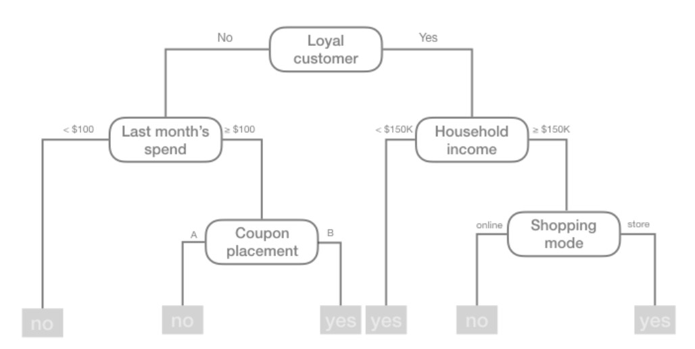
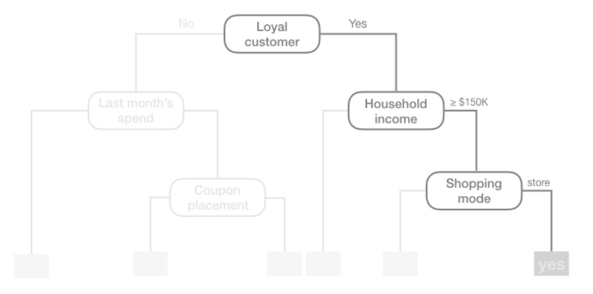
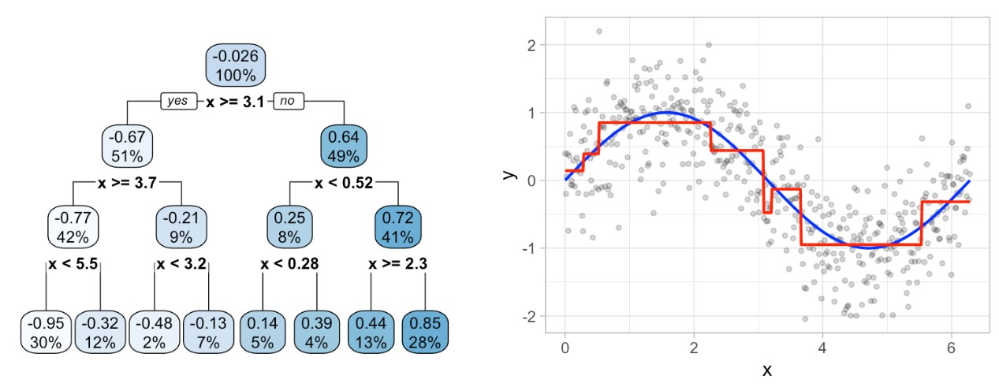
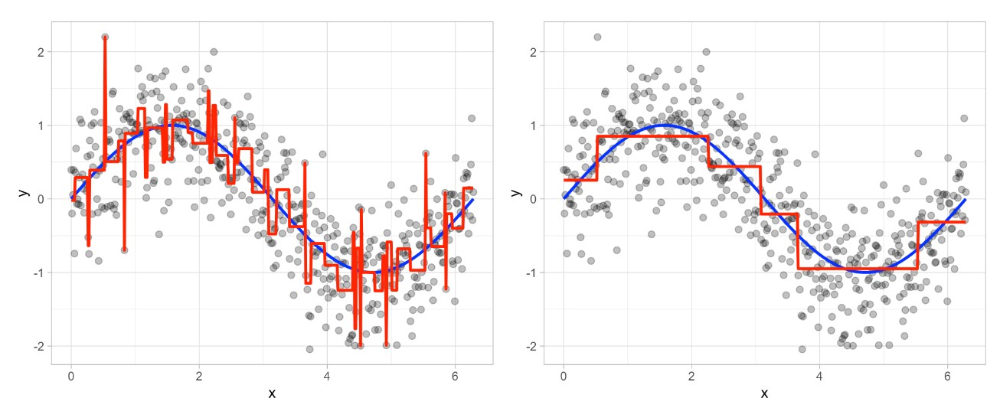

---
output:
  html_document: default
  pdf_document: default
---
# Lecture 20 {-}

&nbsp;


## Decision Trees {-}

**Tree-based models** are a class of nonparametric algorithms that work by partitioning the feature space into a number of smaller (non-overlapping) regions with similar response values using a set of **splitting rules**. Predictions are obtained by fitting a simpler model (e.g., a constant like the average response value) in each region.

Such methods can produce simple rules that are easy to interpret and visualize with tree diagrams. As we’ll see, decision trees offer many benefits; however, they typically lack in predictive performance compared to more complex algorithms such as neural networks.

&nbsp;

### Structure {-}

There are many methodologies for constructing decision trees but the most well-known is the **Classification and Regression Tree (CART)** algorithm. A basic decision tree partitions the training data into homogeneous subgroups (i.e., groups with similar response values) and then fits a **simple constant** in each subgroup (e.g., the mean of the within group response values for regression).

The subgroups (also called **nodes**) are formed recursively using binary partitions formed by asking simple yes-or-no questions about each feature (e.g., is `age < 18?`). This is done a number of times until a suitable stopping criteria is satisfied (e.g., a maximum depth of the tree is reached). After all the partitioning has been done, the model predicts the output based on (1) the average response values for all observations that fall in that subgroup (regression problem), or (2) the class that has majority representation (classification problem).

In essence, our tree is a set of rules that allows us to make predictions by asking simple yes-or-no questions about each feature. Consider the following example: suppose you are interested in predicting whether or not a customer will redeem a coupon (`yes` or `no`) based on the customer’s loyalty, household income, last month’s spend, coupon placement, and shopping mode. You can build a decision tree to make these predictions. The tree diagram given in the figure below depicts such a model:

```{r, echo=FALSE, out.width="100%"}

```

For example, based on this decision tree, we predict that if the customer is loyal, has household income greater than $150,000, and is shopping in a store, then the customer will redeem a coupon.

```{r, echo=FALSE, out.width="100%"}

```

We refer to the first subgroup at the top of the tree as the **root node** (this node contains all of the training data). The final subgroups at the bottom of the tree are called the **terminal nodes** or **leaves**. Every subgroup in between is referred to as an **internal node**. The connections between nodes are called **branches**:

```{r, echo=FALSE, out.width="100%"}
knitr::include_graphics("images/tree3.jpg")
```

&nbsp;

### Partitioning {-}

As illustrated above, CART uses **binary recursive partitioning** (it’s recursive because each split or rule depends on the the splits above it). The objective at each node is to find the “best” feature ($x_i$) to partition the remaining data into one of two regions ($R_1$ and $R_2$)  such that the overall error between the actual response ($y_i$) and the predictor constant ($c_i$) is minimized. For regression problems, the objective function to minimize is the total SSE as defined below:

\begin{align*}
SSE = \sum_{i \in R_1}(y_i - c_1)^2 + \sum_{i \in R_2}(y_i - c_2)^2
\end{align*}

For classification problems, the partitioning is usually made to maximize the reduction in **cross-entropy** or the **Gini index** (aka **Gini impurity**). Gini index measures the degree or probability of a particular variable being wrongly classified when it is randomly chosen and is given by

\begin{align*}
Gini = 1 - \sum_{i = 1}^{n}(p_i)^2
\end{align*}

where $p_i$ is the probability of an object being classified to a particular class.

Having found the best feature/split combination, the data are partitioned into two regions and the splitting process is repeated on each of the two regions (hence the name binary recursive partitioning). This process is continued until a suitable stopping criterion is reached (e.g., a maximum depth is reached or the tree becomes “too complex”).

It’s important to note that a single feature can be used multiple times in a tree. For example, say we have data generated from a simple **_sin_** function with Gaussian noise: $Y_i \sim N(sin(X_i), \sigma^2)$ for $i = 1, 2, 3, \dots, 500$. A regression tree built with a single root node (often referred to as a decision stump) leads to a split occurring at $x = 3.1$.

```{r, echo=FALSE, out.width="100%"}
knitr::include_graphics("images/tree4.jpg")
```

If we build a deeper tree, we’ll continue to split on the same feature ($x$) as illustrated in the figure below. This is because $x$ is the only feature available to split on so it will continue finding the optimal splits along this feature’s values until a pre-determined stopping criteria is reached. 

```{r, echo=FALSE, out.width="100%"}

```

However, even when many features are available, a single feature may still dominate if it continues to provide the best split after each successive partition. 

&nbsp;

### Tree Depth {-}

This leads to an important question: how deep (i.e., complex) should we make the tree? If we grow an overly complex tree as illustrated below, we tend to overfit to our training data resulting in poor generalization performance:

```{r, echo=FALSE, out.width="100%"}
knitr::include_graphics("images/tree6.jpg")
```

Consequently, there is a balance to be achieved in the depth and complexity of the tree to optimize predictive performance on future unseen data. To find this balance, we have two primary approaches: (1) early stopping and (2) pruning.

&nbsp;

### Early Stopping {-}

Early stopping explicitly restricts the growth of the tree. There are several ways we can restrict tree growth but two of the most common approaches are to restrict the tree depth to a certain level or to restrict the minimum number of observations allowed in any terminal node. When limiting tree depth we stop splitting after a certain depth (e.g., only grow a tree that has a depth of 5 levels). The shallower the tree the less variance we have in our predictions; however, at some point we can start to inject too much bias as shallow trees (e.g., stumps) are not able to capture interactions and complex patterns in our data.

When restricting minimum terminal node size (e.g., leaf nodes must contain at least 10 observations for predictions) we are deciding to not split intermediate nodes which contain too few data points. At the far end of the spectrum, a terminal node’s size of one allows for a single observation to be captured in the leaf node and used as a prediction (in this case, we’re interpolating the training data). This results in high variance and poor generalizability. On the other hand, large values restrict further splits therefore reducing variance.

These two approaches can be implemented independently of one another; however, they do have interaction effects as illustrated in the figure below: The columns illustrate how tree depth impacts the decision boundary and the rows illustrate how the minimum number of observations in the terminal node influences the decision boundary.

```{r, echo=FALSE, out.width="100%"}
knitr::include_graphics("images/tree7.jpg")
```

&nbsp;

### Pruning {-}

An alternative to explicitly specifying the depth of a decision tree is to grow a very large, complex tree and then **prune** it back to find an optimal subtree. We find the optimal subtree by using a **cost complexity parameter** ($\alpha$) that penalizes our objective function (defined in the _Partitioning_ section) for the number of terminal nodes of the tree ($T$) as follows:

\begin{align*}
minimize \{SSE + \alpha|T|\}
\end{align*}

For a given value of $\alpha$ we find the smallest pruned tree that has the lowest penalized error. Smaller penalties tend to produce more complex models, which result in larger trees. Whereas larger penalties result in much smaller trees. Consequently, as a tree grows larger, the reduction in the SSE must be greater than the cost complexity penalty. Typically, we evaluate multiple models across a spectrum of $\alpha$ and use  CV to identify the optimal value and, therefore, the optimal subtree that generalizes best to unseen data. 

The figure below illustrates the pruning results: we grow an overly complex tree (left) and then use a cost complexity parameter to identify the optimal subtree (right):

```{r, echo=FALSE, out.width="100%"}

```


&nbsp;

## Random Forest {-}

Before we introduce a random forest method, let's describe **bagging**. **Bootstrap aggregating (bagging)** prediction models is a general method for fitting multiple versions of a prediction model and then combining (or ensembling) them into an aggregated prediction. 

Bagging is a fairly straight forward algorithm in which _b_ bootstrap copies of the original training data are created, the regression or classification algorithm (commonly referred to as the **base learner**) is applied to each bootstrap sample and, in the regression context, new predictions are made by averaging the predictions together from the individual base learners. When dealing with a classification problem, the base learner predictions are combined using plurality vote or by averaging the estimated class probabilities together.

Because of the aggregation process, bagging effectively reduces the variance of an individual base learner (i.e., averaging reduces variance). The general idea behind bagging is referred to as the “wisdom of the crowd” effect. It essentially means that the aggregation of information in large diverse groups results in decisions that are often better than could have been made by any single member of the group. The more diverse the group members are then the more diverse their perspectives and predictions will be, which often leads to better aggregated information.

However, when bagging trees, a problem still exists. Although the model building steps are independent, the trees in bagging are not completely independent of each other since all the original features are considered at every split of every tree. Rather, trees from different bootstrap samples typically have similar structure to each other (especially at the top of the tree) due to any underlying strong relationships.

This characteristic is known as **tree correlation** and prevents bagging from further reducing the variance of the base learner. Now we will discuss how **random forests** extend and improve upon bagged decision trees by reducing this correlation and thereby improving the accuracy of the overall ensemble.

***

_Random forests_ are a modification of bagged decision trees that build a large collection of de-correlated trees to further improve predictive performance. Random forests help to reduce tree correlation by injecting more randomness into the tree-growing process.

More specifically, while growing a decision tree during the bagging process, random forests perform split-variable randomization where each time a split is to be performed, the search for the split variable is limited to a random subset of $m$ of the original _p_ features. Typical default values are $m = p/3$ (regression) and $m = \sqrt{p}$ (classification) but this should be considered a tuning parameter.

```{r, echo=FALSE, out.width="100%"}
knitr::include_graphics("images/rf.jpg")
```

#### Hyperparameters {-}

There are several tunable hyperparameters that we should consider when training a model:

* The number of trees in the forest
* The number of features to consider at any given split: $m$
* The complexity of each tree

&nbsp;

**Number of trees**

The first consideration is the number of trees within your random forest. Although not technically a hyperparameter, the number of trees needs to be sufficiently large to stabilize the error rate. A good rule of thumb is to start with 10 times the number of features. However, as you adjust other hyperparameters such as $m$ and node size, more or fewer trees may be required. More trees provide more robust and stable error estimates and variable importance measures; however, the impact on computation time increases linearly with the number of trees.

&nbsp;

**The number of features to consider at any given split: $m$**

The hyperparameter that controls the split-variable randomization feature of random forests is often referred to as $m$ and it helps to balance low tree correlation with reasonable predictive strength. With regression problems the default value is often $m = p/3$ and for classification $m = \sqrt{p}$. However, when there are fewer relevant predictors (e.g., noisy data) a higher value of $m$  tends to perform better because it makes it more likely to select those features with the strongest signal. When there are many relevant predictors, a lower $m$ might perform better.

&nbsp;

**The complexity of each tree**

Random forests are built on individual decision trees; consequently, most random forest implementations have one or more hyperparameters that allow us to control the depth and complexity of the individual trees. This will often include hyperparameters such as node size, max depth, max number of terminal nodes, or the required node size to allow additional splits.