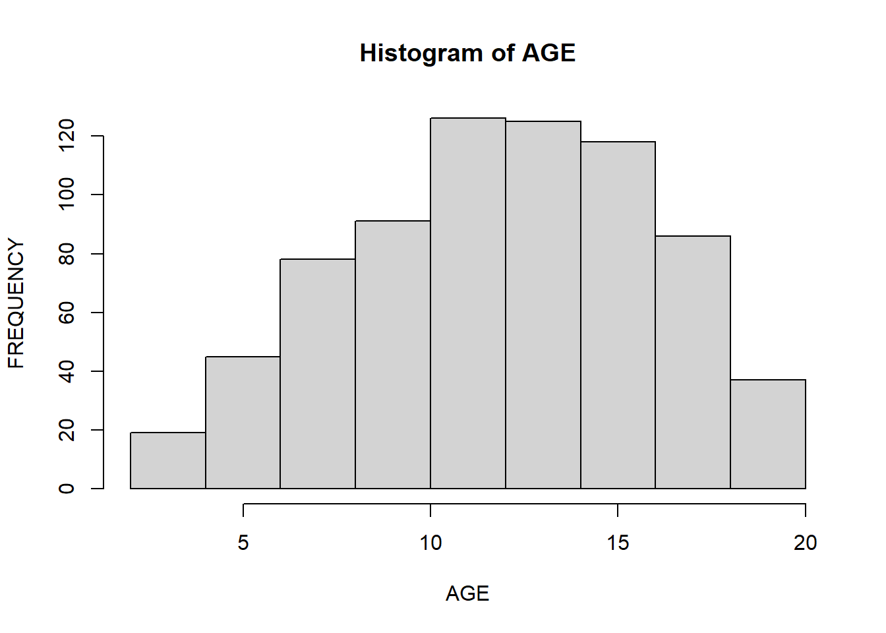
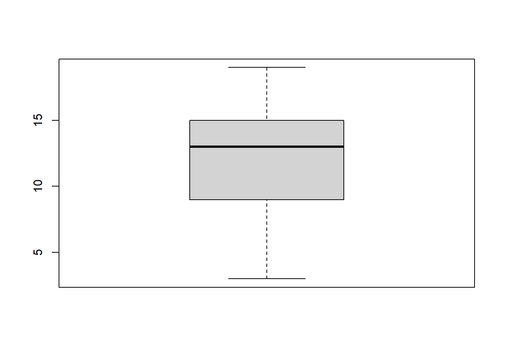
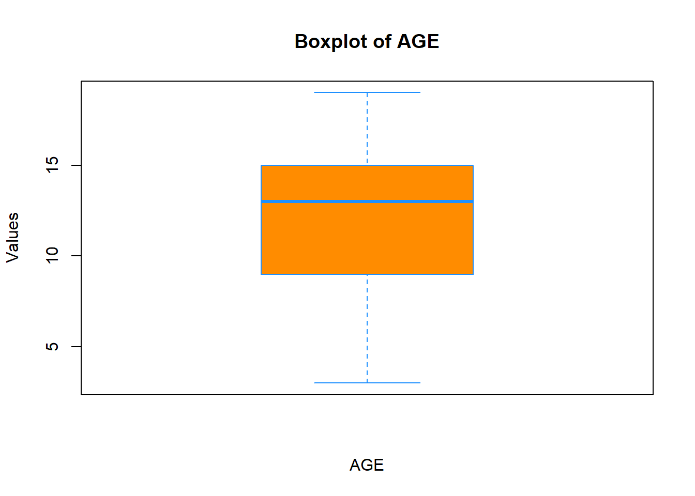
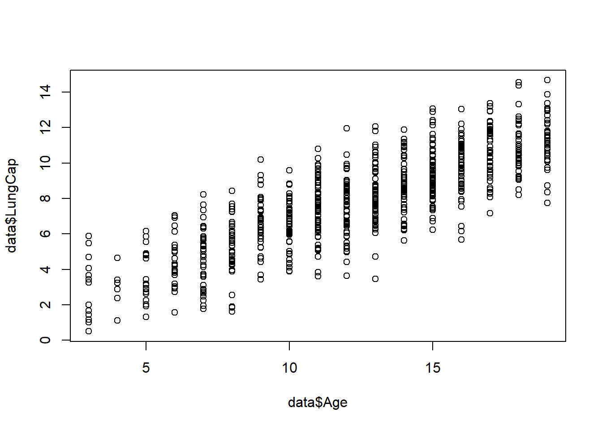
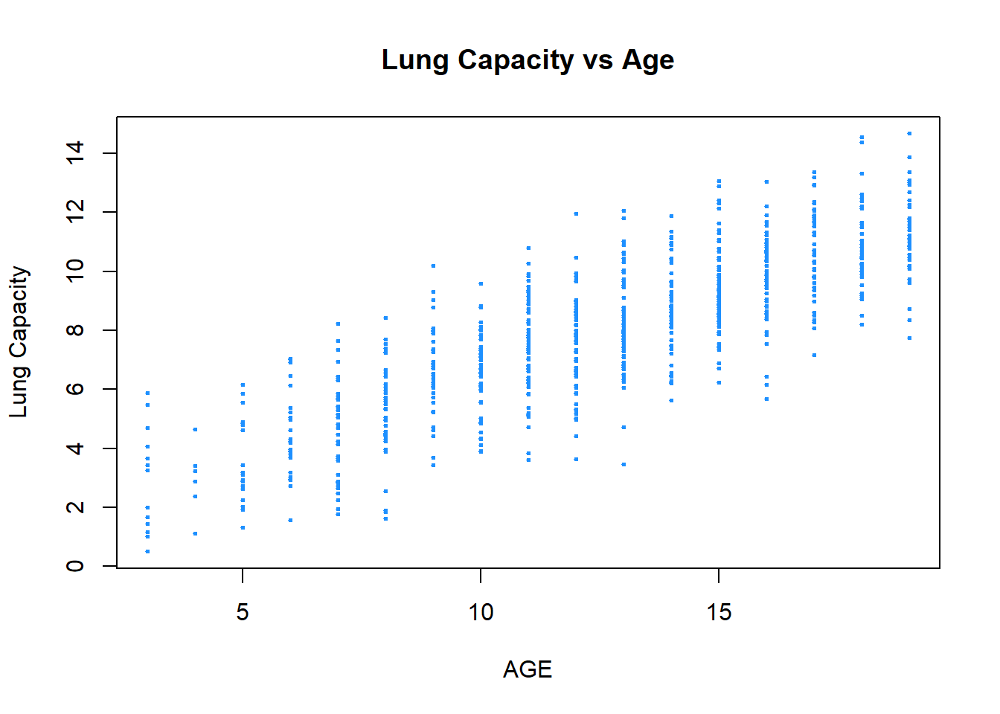

# Lecture 08 {-}

&nbsp;

Last lecture we learned how to utilize `apply` family of functions that implements looping over a matrix, data frame, or list in a compact form. But what if you want to apply a function over subsets of a vector? Or what if you want to split a vector into subsets, compute summary statistics for each subset and return the result in a group by form? 

If that's what you are trying to do, then you will find the `tapply()` and `aggregate()` functions very useful. They will come in handy when you start analyzing your own data. Now, let's see how these functions work.

We will be using the same data set as before (**Lung Capacity** data set), which is available on Courseworks.


```r

data <- read.table(file = "C:/Users/alexp/OneDrive/Desktop/lung_capacity.txt", header = T, sep = "", stringsAsFactors = TRUE)
```

Notice, we added one more argument `stringsAsFactors = TRUE`. It converts all character vectors in the data frame into factors.


## tapply() Function {-}

`tapply()` function is another member of the `apply` family of functions. `tapply()` is used to apply a function over subsets of a vector. It allows you to create group summaries based on factor levels of another variables. The arguments to `tapply()` function are as follows:


```r

tapply(X, INDEX, FUN, ...)

```


* `X` - is an input vector
* `INDEX` - is a factor variable (or a list of factor variables)
* `FUN` - is a function to be applied
* `...` - other arguments


Now, suppose you want to calculate the mean value of `Age` for male and female patients separately. You can do it by passing `Age` and `Sex` variables along with the `mean` function to `tappy()`:


```r

tapply(data$Age, data$Sex, mean)
#>   FEMALE     MALE 
#> 12.44972 12.20708
```

You can pass a user-defined function as well. First, let's create a `function_1` that returns mean and median values of a vector:


```r

function_1 <- function(x){
  
  return(c(Mean = mean(x), Median = median(x)))
  
}
```

Now, let's pass it to `tapply()` function:


```r

tapply(data$Age, data$Sex, function_1)
#> $FEMALE
#>     Mean   Median 
#> 12.44972 13.00000 
#> 
#> $MALE
#>     Mean   Median 
#> 12.20708 12.00000
```

We can have even more complex scenarios with two or more factor variables. In that case, factor variables should be put in a list:


```r

tapply(data$Age, list(data$Sex, data$Smoke), mean)
#>              NO      YES
#> FEMALE 12.12739 14.75000
#> MALE   11.94910 14.81818
```


```r

tapply(data$Age, list(data$Sex, data$Smoke, data$Status), mean)
#> , , HEALTHY
#> 
#>              NO      YES
#> FEMALE 11.89326 15.00000
#> MALE   12.13408 14.69231
#> 
#> , , STAGE_1
#> 
#>              NO      YES
#> FEMALE 12.23529 13.87500
#> MALE   11.69231 15.33333
#> 
#> , , STAGE_2
#> 
#>              NO YES
#> FEMALE 12.54545  14
#> MALE   11.72093  NA
#> 
#> , , STAGE_3
#> 
#>              NO      YES
#> FEMALE 13.16667 15.33333
#> MALE   11.95238 15.00000
```


## aggregate() Function {-}

Another way of splitting vectors into subsets and computing summary statistics for each subset is using `aggregate()` function. It is useful in performing all the aggregate operations like sum, count, mean, median, and so on. The arguments to `aggregate()` function are as follows: 


```r

aggregate(X, by, FUN, ...)

```


* `X` - is an input object
* `by` - is a list of grouping elements, by which the subsets are grouped by
* `FUN` - is a function to be applied
* `...` - other arguments


Here are some examples:


```r

aggregate(data$LungCap, list(data$Smoke), median)
#>   Group.1    x
#> 1      NO 7.90
#> 2     YES 8.65
```


```r

aggregate(data$LungCap, list(data$Smoke, data$Sex), median)
#>   Group.1 Group.2      x
#> 1      NO  FEMALE 7.6000
#> 2     YES  FEMALE 8.1625
#> 3      NO    MALE 8.2125
#> 4     YES    MALE 9.3500
```


```r

aggregate(data$LungCap, list(data$Smoke, data$Sex, data$Status), median)
#>    Group.1 Group.2 Group.3       x
#> 1       NO  FEMALE HEALTHY  7.4375
#> 2      YES  FEMALE HEALTHY  8.2375
#> 3       NO    MALE HEALTHY  8.2000
#> 4      YES    MALE HEALTHY  9.0750
#> 5       NO  FEMALE STAGE_1  7.7500
#> 6      YES  FEMALE STAGE_1  7.8375
#> 7       NO    MALE STAGE_1  8.0750
#> 8      YES    MALE STAGE_1 10.1000
#> 9       NO  FEMALE STAGE_2  8.2750
#> 10     YES  FEMALE STAGE_2  7.9500
#> 11      NO    MALE STAGE_2  8.3500
#> 12      NO  FEMALE STAGE_3  7.7250
#> 13     YES  FEMALE STAGE_3  8.1250
#> 14      NO    MALE STAGE_3  7.8250
#> 15     YES    MALE STAGE_3  9.8750
```


```r

aggregate(data$LungCap, list(data$Smoke, data$Sex, data$Status), function_1)
#>    Group.1 Group.2 Group.3    x.Mean  x.Median
#> 1       NO  FEMALE HEALTHY  7.212258  7.437500
#> 2      YES  FEMALE HEALTHY  8.341667  8.237500
#> 3       NO    MALE HEALTHY  8.385335  8.200000
#> 4      YES    MALE HEALTHY  9.144231  9.075000
#> 5       NO  FEMALE STAGE_1  7.208529  7.750000
#> 6      YES  FEMALE STAGE_1  7.575000  7.837500
#> 7       NO    MALE STAGE_1  8.153297  8.075000
#> 8      YES    MALE STAGE_1  9.875000 10.100000
#> 9       NO  FEMALE STAGE_2  7.681061  8.275000
#> 10     YES  FEMALE STAGE_2  7.716667  7.950000
#> 11      NO    MALE STAGE_2  7.811047  8.350000
#> 12      NO  FEMALE STAGE_3  7.913889  7.725000
#> 13     YES  FEMALE STAGE_3  8.275000  8.125000
#> 14      NO    MALE STAGE_3  7.802381  7.825000
#> 15     YES    MALE STAGE_3  9.875000  9.875000
```


```r

aggregate(data[ ,c("Age", "LungCap")], list(data$Smoke), median)
#>   Group.1 Age LungCap
#> 1      NO  12    7.90
#> 2     YES  15    8.65
```


***

&nbsp;

## Data Visualization {-}

We have already learned how to use R built-in functions to compute basic numerical summaries of data such as mean, median, IQR, quantiles, and so on. In this lecture, we are going to learn how to get summary of your data via visualization. 

**Data visualization** plays a crucial role in data analysis. Prior to building statistical models or performing any other statistical procedure, you will want to plot your data as it will suggest what statistical tools might be more appropriate. In this lecture, you will learn how to visualize data in `Base R`. Later in the semester, we will learn how to use `ggplot2` package to do so. It is more versatile and has advanced visualization tools.


### Histograms {-}

Histograms display a distribution of numerical data. They represent the frequencies of values of a variable bucketed into ranges. The function `hist()` is used to plot histograms. Let's plot a histogram of the `Age` variable:


```r

hist(data$Age)
```


You can change labels of a histogram by passing `xlab`, `ylab`, and `main` arguments to the function:


```r

hist(data$Age,
     
     xlab = "AGE",
     
     ylab = "FREQUENCY",
     
     main = "Histogram of AGE")
```



The x-axis contains a range of values of the variable. Histograms divide it into intervals known as bins. Histograms are tricky because it depends on the subjective judgments of where exactly to put the bin margins that what graph you will be looking at. Wide bins produce one picture, narrow bins produce a different picture, and unequal bins produce confusion. You can choose a number of bins to display by passing a `break` argument to the function. In the example, below you specify the starting and ending points of each bin (for instance, 0 to 2, 2 to 4, and so on):


```r

hist(data$Age,
     
     xlab = "AGE",
     
     ylab = "FREQUENCY",
     
     main = "Histogram of AGE",
     
     breaks = seq(0, 20, 2)
     
     )
```


You can change the color of bins and corresponding borders:


```r

hist(data$Age,
     
     xlab = "AGE",
     
     ylab = "FREQUENCY",
     
     main = "Histogram of AGE",
     
     breaks = seq(0, 20, 2),
     
     col = "lightpink",
     
     border = "black")
```


You can display specific parts of a histogram by passing `xlim()` arguments. It will display the part of a histogram that corresponds to the specified range:


```r

hist(data$Age,
     
     xlab = "AGE",
     
     ylab = "FREQUENCY",
     
     main = "Histogram of AGE",
     
     breaks = seq(0, 20, 2),
     
     col = "lightpink",
     
     border = "black",
     
     xlim = c(0, 12)
     
     )
```


### Barplots {-}

Barplots are similar to histograms but are used for categorical/qualitative variables (in R we call them factors). They display levels of a categorical variable and their corresponding frequencies. We will create a barplot for the `Status` variable:


```r

barplot(table(data$Status))
```


Like histgorams, barplots can be customized. Let's add labels to your barplot:


```r

barplot(table(data$Status),
        
        xlab = "Disease Stage",
        
        ylab = "Frequences",
        
        main = "Disease Status",
        
        names.arg = c("Healthy", "Stage 1", "Stage 2", "Stage 3"))
```


Now, let's change the color of bins and borders:


```r

barplot(table(data$Status),
        
        xlab = "Disease Stage",
        
        ylab = "Frequences",
        
        main = "Disease Status",
        
        names.arg = c("Healthy", "Stage 1", "Stage 2", "Stage 3"),
        
        col = "orange",
        
        border = "blue")
```


You can even make a horizontal barplot:


```r

barplot(table(data$Status),
        
        xlab = "Frequences",
        
        ylab = "Disease Stage",
        
        main = "Disease Status",
        
        names.arg = c("Healthy", "Stage 1", "Stage 2", "Stage 3"),
        
        col = "orange",
        
        border = "blue",
        
        horiz = TRUE)
```


In R, you can create clustered barplots. For the two examples given below, guess what they are displaying:


```r

barplot(table(data[, c("Sex", "Status")]),
        
        legend.text = TRUE,
        
        ylab = "Frequences",
        
        xlab = "Disease Stage",
        
        main = "Disease Status vs Sex",
        
        names.arg = c("Healthy", "Stage 1", "Stage 2", "Stage 3"),
        
        col = c("orange", "red"))
```


```r

barplot(table(data[, c("Sex", "Status")]),
        
        beside = TRUE,
        
        legend.text = TRUE,
        
        ylab = "Frequences",
        
        xlab = "Disease Stage",
        
        main = "Disease Status vs Sex",
        
        names.arg = c("Healthy", "Stage 1", "Stage 2", "Stage 3"),
        
        col = c("orange", "red"))
```


### Boxplots {-}

Boxplots are used to visualize a 5-Number summary (Minimum, Q1 (first quartile, also known as 25th percentile), median, Q3 (third quartile, also known as 75th percentile), and Maximum). Below is a boxplot for the `Age` variable:


```r

boxplot(data$Age)
```



Let's add labels to it and change the colors:


```r

boxplot(data$Age,
        
        xlab = "AGE",
        
        ylab = "Values",
        
        main = "Boxplot of AGE",
        
        col = "darkorange",
        
        border = "dodgerblue")
```



You can even add a notch to it if you want to: 


```r

boxplot(data$Age,
        
        xlab = "AGE",
        
        ylab = "Values",
        
        main = "Boxplot of AGE",
        
        col = "darkorange",
        
        border = "dodgerblue",
        
        notch = T)
```


You can change the shape and size of points in the plot by passing `pch` and `cex` arguments, respectfully. Type `?pch` in the console to see what shapes are available.


```r

boxplot(data$Age,
        
        xlab = "AGE",
        
        ylab = "Values",
        
        main = "Boxplot of AGE",
        
        col = "darkorange",
        
        border = "dodgerblue",
        
        notch = T,
        
        pch = 20,
        
        cex  = 2)
```


Often you will be using boxplots to compare a numerical variable for different levels of other categorical variables (that is, levels of a factor). Let's compare boxplots of the `Age` variable for female and male patients:


```r

boxplot(data$Age ~ data$Sex,
        
        xlab = "SEX",
        
        ylab = "AGE",
        
        main = "Grouped Boxplots",
        
        col = c("darkorange", "red"),
        
        border = c("dodgerblue", "black"),
        
        notch = T)
```


Let's make it more complicated:


```r

boxplot(data$Age ~ data$Sex:data$Smoke,
        
        xlab = "COMBINATION OF SEX AND SMOKE VARIABLES",
        
        ylab = "AGE",
        
        main = "Grouped Boxplots",
        
        names = c("F_Nonsmokers","M_Nonsmokers", "F_Smokers", "M_Smokers"),
        
        col = c("darkorange", "red"),
        
        border = c("dodgerblue", "black"),
        
        notch = T)
```


### Scatterplots {-}

As mentioned earlier, before building a statistical model, it is recommended to visualize a relationship among variables. Suppose, you want to build a regression model that will describe the relationship between `Age` and `Lung Capacity` variables. First, we will visualize the data using `plot()` function:


```r

plot(x = data$Age, y = data$LungCap)
```



As you can observe, there is a linear trend between these two variables, so this suggests that a linear regression model might be appropriate. Now let's customize the plot by labeling it and changing the color, shape, and size of the points:


```r

plot(x = data$Age,
     
     y = data$LungCap,
     
     xlab = "AGE",
     
     ylab = "Lung Capacity",
     
     main = "Lung Capacity vs Age",
     
     col = "dodgerblue",
     
     pch = 20,
     
     cex  = 0.5)
```



You can focus on specific parts of the plot by adding `xlim()` argument:


```r

plot(x = data$Age,
     
     y = data$LungCap,
     
     xlab = "AGE",
     
     ylab = "Lung Capacity",
     
     main = "Lung Capacity vs Age",
     
     col = "dodgerblue",
     
     pch = 20,
     
     cex  = 1,
     
     xlim = c(0, 10))
```


You can change the color (or the size) of points based on other factor variables. For example, we can make observation that belong to the female patients be displayed as red dots and observation that belong to the male patients be displayed as blue ones. In addition, we can add legends to clarify the meaning of colors in the plot:


```r

colors <- c("red", "blue")

plot(x = data$Age,
     
     y = data$LungCap,
     
     xlab = "AGE",
     
     ylab = "Lung Capacity",
     
     main = "Lung Capacity vs Age",
     
     col = colors[data$Sex],
     
     pch = 20,
     
     cex  = 1)


legend("topleft", legend = c("FEMALE", "MALE"), pch = 20, col = colors)
```


Finally, in R you are able to display multiple plots in a single image. To do so, you need to use `par()` function. You pass an `mfrow()` argument to this function that specifies dimensions of your final plot. For example, if you want to plot two images in one row (that is, 1 row and 2 columns), then you execute `par(mfrow = c(1, 2))` function followed by the plots that you aim to include in it: 


```r

par(mfrow = c(1, 2))


boxplot(data$LungCap ~ data$Sex,
        
        xlab = "SEX",
        
        ylab = "AGE",
        
        main = "Grouped Boxplots",
        
        col = c("darkorange", "red"),
        
        border = c("dodgerblue", "black"),
        
        notch = T)


plot(x = data$Age,
     
     y = data$LungCap,
     
     xlab = "AGE",
     
     ylab = "Lung Capacity",
     
     main = "Lung Capacity vs Age",
     
     col = colors[data$Sex],
     
     pch = 20,
     
     cex  = 1)


legend("topleft", legend = c("FEMALE", "MALE"), pch = 20, col = colors)
```


