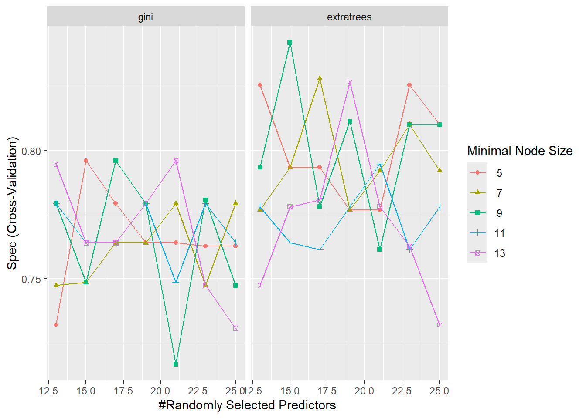
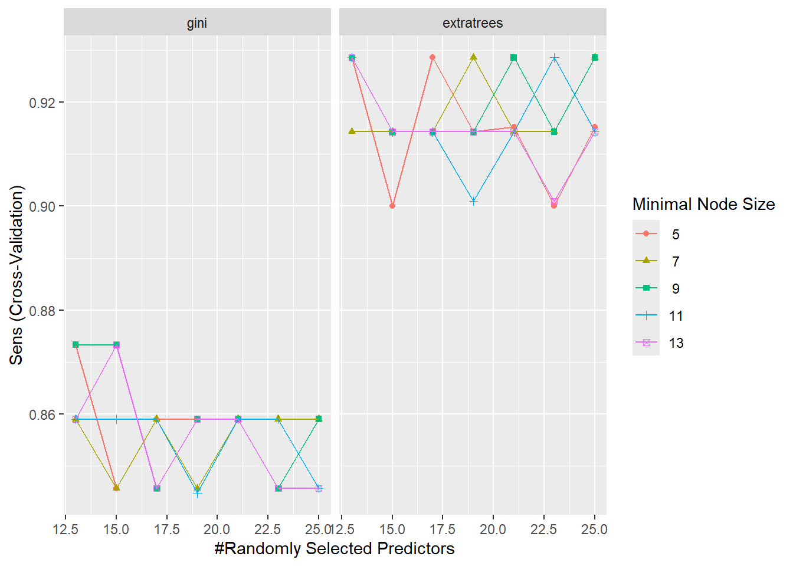
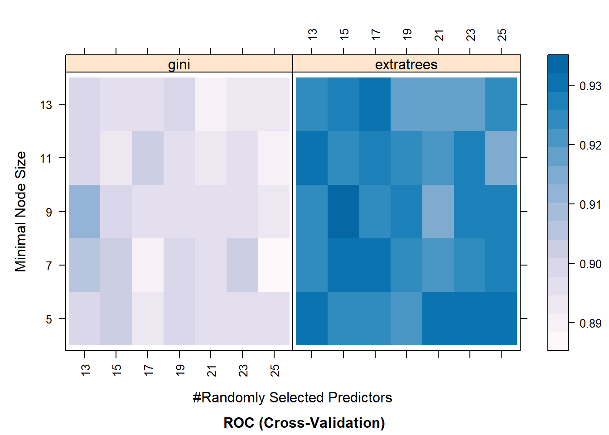

---
output:
  html_document: default
  pdf_document: default
---
# Lecture 19 {-}

&nbsp;


## Resampling Methods: Example {-}

In this lecture, we are going to illustrate a model-building and evaluation processes using resampling methods. To do so, we will utilize `rsample` and `caret` packages. As mentioned earlier, `rsample` package is a part of the family of packages `tidymodels`, thus, installing and loading `tidymodels` package should be enough to activate it.

Similarly, if you have not done it yet, first install the `caret` package in your machine. Then, you can load/activate both packages using a `library()` function as shown below:


```r

library(tidymodels)
#> ── Attaching packages ────────────────── tidymodels 1.1.1 ──
#> ✔ broom        1.0.5      ✔ recipes      1.0.10
#> ✔ dials        1.2.1      ✔ rsample      1.2.0 
#> ✔ dplyr        1.1.4      ✔ tibble       3.2.1 
#> ✔ ggplot2      3.5.0      ✔ tidyr        1.3.1 
#> ✔ infer        1.0.6      ✔ tune         1.2.0 
#> ✔ modeldata    1.3.0      ✔ workflows    1.1.4 
#> ✔ parsnip      1.2.0      ✔ workflowsets 1.0.1 
#> ✔ purrr        1.0.2      ✔ yardstick    1.3.0
#> ── Conflicts ───────────────────── tidymodels_conflicts() ──
#> ✖ purrr::discard() masks scales::discard()
#> ✖ dplyr::filter()  masks stats::filter()
#> ✖ dplyr::lag()     masks stats::lag()
#> ✖ recipes::step()  masks stats::step()
#> • Search for functions across packages at https://www.tidymodels.org/find/

library(caret)
#> Loading required package: lattice
#> 
#> Attaching package: 'caret'
#> The following objects are masked from 'package:yardstick':
#> 
#>     precision, recall, sensitivity, specificity
#> The following object is masked from 'package:purrr':
#> 
#>     lift

library(tidyverse)
#> ── Attaching core tidyverse packages ──── tidyverse 2.0.0 ──
#> ✔ forcats   1.0.0     ✔ readr     2.1.5
#> ✔ lubridate 1.9.3     ✔ stringr   1.5.1
#> ── Conflicts ────────────────────── tidyverse_conflicts() ──
#> ✖ readr::col_factor() masks scales::col_factor()
#> ✖ purrr::discard()    masks scales::discard()
#> ✖ dplyr::filter()     masks stats::filter()
#> ✖ stringr::fixed()    masks recipes::fixed()
#> ✖ dplyr::lag()        masks stats::lag()
#> ✖ caret::lift()       masks purrr::lift()
#> ✖ readr::spec()       masks yardstick::spec()
#> ℹ Use the conflicted package (<http://conflicted.r-lib.org/>) to force all conflicts to become errors
```


The `caret` package (short for **C**lassification **A**nd **RE**gression **T**raining) is a set of functions that attempt to streamline the process for creating predictive models. The package contains tools for:

* Data splitting
* Pre-processing
* Feature selection
* Model tuning using resampling
* Variable importance estimation
* And more

There are many different modeling functions in R. Some have different syntax for model training and/or prediction. The package started off as a way to provide a uniform interface the functions themselves, as well as a way to standardize common tasks (such as parameter tuning and variable importance).

To illustrate a model-building and evaluations procedures, we will use `sonar.csv` dataset (available on Courseworks). This is the data set used by Gorman and Sejnowski in their study of the classification of sonar signals. It contains 61 variables and 208 observations. Each observation is a set  f 60 numbers in the range 0.0 to 1.0. Each number represents the energy within a particular frequency band, integrated over a certain period of time. The integration aperture for higher frequencies occur later in time, since these frequencies are transmitted later during the chirp.

The response variable `Class` has two levels: `R` if the object is a rock and `M` if it is a mine (mental cylinder).

Our goal is to build a predictive model that will predict a class (`R` or `M`) of an observation. We will do it using a random forest method.


&nbsp;

### Data Splitting {-}

As mentioned in **Lecture 17**, we can split our data into training and test data sets to provide an accurate understanding of the generalizability of our final optimal model: training set is used to develop feature sets, train our algorithms, tune hyperparameters, compare models, and all of the other activities required to choose a final model; test set is used to  estimate an unbiased assessment of the model’s performance, which we refer to as the _generalization error_.

In our example, we will use a stratified sampling method to preserve the underlying distribution of the response variable `Class`. 65\% of the original data will be used to train the model and tune its parameters, and the remaining 35\% will be used to assess its performance.


**Note:** It is fair to say that a simple random sample method will be equally good in this example, because the `Class` variable is not severely imbalanced.


```r

data_split <- Sonar %>% initial_split(prop = 0.65, strata = Class)

data_training <- data_split %>% training()

data_test <- data_split %>% testing()
```


You've noticed that the sampling indices are chosen using random numbers, that is, observations are randomly selected into the sample. If you or someone else need to reproduce your results later, then you have to ensure that the same samples will be used between calls. This can be done using `set.seed()` function:


```r

set.seed(1)


data_split <- Sonar %>% initial_split(prop = 0.65, strata = Class)

data_training <- data_split %>% training()

data_test <- data_split %>% testing()
```


&nbsp;

### Model Training and Parameter Tuning {-}

The model-training process starts with a parameter tuning procedure. As mentioned in the previous lecture, a random forest method has multiple hyperparameters and optimal values for these parameters must be chosen in order to achieve a better performance. In other words, we have to choose a combination of hyperparameter values that enhances the model's performance.

We are going to consider the following hyperparameters: splitting rule (`splitrule`), minimal node size to split at (`min.node.size`), and a number of variables to possibly split at in each node (`mtry`). 

The tuning parameter grid can be specified by the user. Suppose we have the following set of values for our hyperparameters: `splitrule = {"gini", "extratrees"}`, `min.node.size = {5, 7, 9, 11, 13}`, `mtry = {13, 15, 17, 19, 21, 23, 25}`. Use `expand.grid()` function to create all possible combinations of these parameters:


```r

rf_grid <- expand.grid(.mtry = c(13, 15, 17, 19, 21, 23, 25),
                        
                       .min.node.size = c(5, 7, 9, 11, 13),
                        
                       .splitrule = c("gini", "extratrees"))
```

This approach is called _full Cartesian grid searches_ where we assess every combination of hyperparameters of interest:


```r

print(rf_grid)
#>    .mtry .min.node.size .splitrule
#> 1     13              5       gini
#> 2     15              5       gini
#> 3     17              5       gini
#> 4     19              5       gini
#> 5     21              5       gini
#> 6     23              5       gini
#> 7     25              5       gini
#> 8     13              7       gini
#> 9     15              7       gini
#> 10    17              7       gini
#> 11    19              7       gini
#> 12    21              7       gini
#> 13    23              7       gini
#> 14    25              7       gini
#> 15    13              9       gini
#> 16    15              9       gini
#> 17    17              9       gini
#> 18    19              9       gini
#> 19    21              9       gini
#> 20    23              9       gini
#> 21    25              9       gini
#> 22    13             11       gini
#> 23    15             11       gini
#> 24    17             11       gini
#> 25    19             11       gini
#> 26    21             11       gini
#> 27    23             11       gini
#> 28    25             11       gini
#> 29    13             13       gini
#> 30    15             13       gini
#> 31    17             13       gini
#> 32    19             13       gini
#> 33    21             13       gini
#> 34    23             13       gini
#> 35    25             13       gini
#> 36    13              5 extratrees
#> 37    15              5 extratrees
#> 38    17              5 extratrees
#> 39    19              5 extratrees
#> 40    21              5 extratrees
#> 41    23              5 extratrees
#> 42    25              5 extratrees
#> 43    13              7 extratrees
#> 44    15              7 extratrees
#> 45    17              7 extratrees
#> 46    19              7 extratrees
#> 47    21              7 extratrees
#> 48    23              7 extratrees
#> 49    25              7 extratrees
#> 50    13              9 extratrees
#> 51    15              9 extratrees
#> 52    17              9 extratrees
#> 53    19              9 extratrees
#> 54    21              9 extratrees
#> 55    23              9 extratrees
#> 56    25              9 extratrees
#> 57    13             11 extratrees
#> 58    15             11 extratrees
#> 59    17             11 extratrees
#> 60    19             11 extratrees
#> 61    21             11 extratrees
#> 62    23             11 extratrees
#> 63    25             11 extratrees
#> 64    13             13 extratrees
#> 65    15             13 extratrees
#> 66    17             13 extratrees
#> 67    19             13 extratrees
#> 68    21             13 extratrees
#> 69    23             13 extratrees
#> 70    25             13 extratrees
```


Next, we need to select a resampling method. It is done using a `trainControl()` function. This function has the following arguments:

* `method` - the resampling method: `boot`, `cv`, `LOOCV`, `LGOCV`, `repeatedcv`, and so on
* `number` and `repeats` - `number` controls the number of folds in _K_-fold cross validation or number of resampling iterations for bootstrapping and leave-group-out cross-validation. `repeats` applies only to repeated _K_-fold cross validation and indicates how many times it should be repeated
* `classProbs` - a logical value determining whether class probabilities should be computed for held-out samples during resample
* `summaryFunction` -  a function to compute alternate performance summaries

&nbsp;

For instance, the following function performs 5-fold cross validation:


```r

# keep classProbs and summaryFunction values as they are 

set.seed(1)

fitControl_1 <- trainControl(method = "cv",
                           
                             number = 5,
                           
                             classProbs = TRUE,
                           
                             summaryFunction = twoClassSummary)
```

And the next function performs 10-fold cross validation:


```r

fitControl_2 <- trainControl(method = "cv",
                           
                             number = 10,
                           
                             classProbs = TRUE,
                           
                             summaryFunction = twoClassSummary)
```


Use the following function if you want to perform a 5-fold cross validation repeated 7 times:


```r

fitControl_3 <- trainControl(method = "repeatedcv",
                           
                             number = 5,
                           
                             repeats = 7,
                           
                             classProbs = TRUE,
                           
                             summaryFunction = twoClassSummary)
```


Finally, the next function can be utilized for generating 10 bootstrap samples:


```r

fitControl_3 <- trainControl(method = "boot",
                             
                             number = 10,
                             
                             classProbs = TRUE,
                             
                             summaryFunction = twoClassSummary)
```


For our analysis we will stick with a 5-fold cross validation technique. In order to identify an optimal combination of hyperparameter values, that is to train the model, we will use a `train()` function. After resampling, the `train` function produces a profile of performance measures to guide the user as to which tuning parameter values should be chosen:


```r

set.seed(1)

RF_model <- train(Class ~ ., data = data_training,
             
             method = "ranger",
             
             trControl = fitControl_1,
             
             verbose = FALSE,
             
             tuneGrid = rf_grid,
             
             metric = "ROC",
             
             num.tree = 600)

```

Note that `num.tree` is also a hyperparameter, but instead of tuning this parameter, we've decided to just give it a default value of 600. Here, method argument specifies a type of model you are going to use (in this case, `ranger` corresponds to a random forest model); keep `verbose` and `metric` arguments as they are.

Model-training process might take some time, so be patient. After the process is complete, it will produce the following output:


```r

print(RF_model$results)
#>    mtry min.node.size  splitrule       ROC      Sens
#> 1    13             5       gini 0.9006227 0.8733333
#> 3    13             7       gini 0.9061905 0.8590476
#> 5    13             9       gini 0.9110806 0.8733333
#> 7    13            11       gini 0.8997802 0.8590476
#> 9    13            13       gini 0.8990842 0.8590476
#> 2    13             5 extratrees 0.9296886 0.9285714
#> 4    13             7 extratrees 0.9229487 0.9142857
#> 6    13             9 extratrees 0.9238645 0.9285714
#> 8    13            11 extratrees 0.9308059 0.9285714
#> 10   13            13 extratrees 0.9256777 0.9285714
#> 11   15             5       gini 0.9039744 0.8457143
#> 13   15             7       gini 0.9010440 0.8457143
#> 15   15             9       gini 0.8984066 0.8733333
#> 17   15            11       gini 0.8926190 0.8590476
#> 19   15            13       gini 0.8960989 0.8733333
#> 12   15             5 extratrees 0.9245421 0.9000000
#> 14   15             7 extratrees 0.9318864 0.9142857
#> 16   15             9 extratrees 0.9320696 0.9142857
#> 18   15            11 extratrees 0.9253846 0.9142857
#> 20   15            13 extratrees 0.9262821 0.9142857
#> 21   17             5       gini 0.8919048 0.8590476
#> 23   17             7       gini 0.8907875 0.8590476
#> 25   17             9       gini 0.8952198 0.8457143
#> 27   17            11       gini 0.9023443 0.8590476
#> 29   17            13       gini 0.8968681 0.8457143
#> 22   17             5 extratrees 0.9255128 0.9285714
#> 24   17             7 extratrees 0.9292491 0.9142857
#> 26   17             9 extratrees 0.9227106 0.9142857
#> 28   17            11 extratrees 0.9268681 0.9142857
#> 30   17            13 extratrees 0.9291758 0.9142857
#> 31   19             5       gini 0.9004396 0.8590476
#> 33   19             7       gini 0.9004212 0.8457143
#> 35   19             9       gini 0.8973810 0.8590476
#> 37   19            11       gini 0.8969597 0.8447619
#> 39   19            13       gini 0.8998352 0.8590476
#> 32   19             5 extratrees 0.9222344 0.9142857
#> 34   19             7 extratrees 0.9241392 0.9285714
#> 36   19             9 extratrees 0.9277289 0.9142857
#> 38   19            11 extratrees 0.9251832 0.9009524
#> 40   19            13 extratrees 0.9168132 0.9142857
#> 41   21             5       gini 0.8973626 0.8590476
#> 43   21             7       gini 0.8967399 0.8590476
#> 45   21             9       gini 0.8962088 0.8590476
#> 47   21            11       gini 0.8930952 0.8590476
#> 49   21            13       gini 0.8890293 0.8590476
#> 42   21             5 extratrees 0.9304029 0.9152381
#> 44   21             7 extratrees 0.9204945 0.9142857
#> 46   21             9 extratrees 0.9162271 0.9285714
#> 48   21            11 extratrees 0.9199817 0.9142857
#> 50   21            13 extratrees 0.9169780 0.9142857
#> 51   23             5       gini 0.8963919 0.8457143
#> 53   23             7       gini 0.9016484 0.8590476
#> 55   23             9       gini 0.8971429 0.8457143
#> 57   23            11       gini 0.8969597 0.8590476
#> 59   23            13       gini 0.8933333 0.8457143
#> 52   23             5 extratrees 0.9318681 0.9000000
#> 54   23             7 extratrees 0.9243223 0.9142857
#> 56   23             9 extratrees 0.9267766 0.9142857
#> 58   23            11 extratrees 0.9266850 0.9285714
#> 60   23            13 extratrees 0.9187912 0.9009524
#> 61   25             5       gini 0.8959158 0.8590476
#> 63   25             7       gini 0.8883516 0.8590476
#> 65   25             9       gini 0.8941026 0.8590476
#> 67   25            11       gini 0.8895604 0.8457143
#> 69   25            13       gini 0.8927289 0.8457143
#> 62   25             5 extratrees 0.9301648 0.9152381
#> 64   25             7 extratrees 0.9287546 0.9285714
#> 66   25             9 extratrees 0.9270147 0.9285714
#> 68   25            11 extratrees 0.9143773 0.9142857
#> 70   25            13 extratrees 0.9232051 0.9142857
#>         Spec      ROCSD    SensSD     SpecSD
#> 1  0.7320513 0.08990768 0.1384069 0.08239112
#> 3  0.7474359 0.07419924 0.1440663 0.05903007
#> 5  0.7794872 0.06438628 0.1185513 0.05832981
#> 7  0.7794872 0.09560822 0.1440663 0.07975554
#> 9  0.7948718 0.08449915 0.1440663 0.03511042
#> 2  0.8256410 0.07212311 0.1237179 0.08640778
#> 4  0.7769231 0.06673128 0.1277753 0.08664523
#> 6  0.7935897 0.07200154 0.1237179 0.08817307
#> 8  0.7782051 0.07468626 0.1237179 0.06306858
#> 10 0.7474359 0.07363915 0.1010153 0.05903007
#> 11 0.7961538 0.07426084 0.1384478 0.08387399
#> 13 0.7487179 0.09249908 0.1384478 0.09447248
#> 15 0.7487179 0.08986927 0.1384069 0.07724292
#> 17 0.7641026 0.08659265 0.1440663 0.07057107
#> 19 0.7641026 0.08439979 0.1185513 0.07057107
#> 12 0.7935897 0.06470093 0.1564922 0.08817307
#> 14 0.7935897 0.06775704 0.1277753 0.04309676
#> 16 0.8423077 0.07276194 0.1277753 0.11246301
#> 18 0.7641026 0.06104033 0.1277753 0.07057107
#> 20 0.7782051 0.07143591 0.1277753 0.06306858
#> 21 0.7794872 0.07910205 0.1440663 0.05832981
#> 23 0.7641026 0.10437005 0.1440663 0.08910026
#> 25 0.7961538 0.07769558 0.1384478 0.08387399
#> 27 0.7641026 0.07679808 0.1440663 0.07057107
#> 29 0.7641026 0.08234440 0.1384478 0.07057107
#> 22 0.7935897 0.07164502 0.1010153 0.12132162
#> 24 0.8282051 0.07240074 0.1548535 0.11380688
#> 26 0.7782051 0.07074391 0.1277753 0.03192282
#> 28 0.7615385 0.07327488 0.1277753 0.08088108
#> 30 0.7807692 0.06816071 0.1277753 0.12727225
#> 31 0.7641026 0.08362865 0.1440663 0.07057107
#> 33 0.7641026 0.07908652 0.1384478 0.07057107
#> 35 0.7794872 0.08782232 0.1440663 0.05832981
#> 37 0.7794872 0.08638746 0.1717457 0.05832981
#> 39 0.7794872 0.08621989 0.1440663 0.05832981
#> 32 0.7769231 0.05901719 0.1277753 0.03987777
#> 34 0.7769231 0.06811197 0.1237179 0.08664523
#> 36 0.8115385 0.07423590 0.1277753 0.11885798
#> 38 0.7782051 0.07228095 0.1198260 0.06306858
#> 40 0.8269231 0.06965189 0.1277753 0.09847623
#> 41 0.7641026 0.08142646 0.1440663 0.07057107
#> 43 0.7794872 0.07983798 0.1440663 0.05832981
#> 45 0.7166667 0.09334520 0.1440663 0.11161948
#> 47 0.7487179 0.08087194 0.1440663 0.09447248
#> 49 0.7961538 0.09004152 0.1440663 0.08387399
#> 42 0.7769231 0.06419149 0.1175332 0.08664523
#> 44 0.7923077 0.06740898 0.1277753 0.07373188
#> 46 0.7615385 0.07935135 0.1010153 0.05540331
#> 48 0.7948718 0.07375225 0.1277753 0.08754167
#> 50 0.7782051 0.06720856 0.1277753 0.06306858
#> 51 0.7628205 0.07228633 0.1384478 0.05047441
#> 53 0.7474359 0.09005690 0.1440663 0.05903007
#> 55 0.7807692 0.09077218 0.1384478 0.09619657
#> 57 0.7794872 0.08510096 0.1440663 0.05832981
#> 59 0.7474359 0.07727523 0.1384478 0.05903007
#> 52 0.8256410 0.06147346 0.1564922 0.08640778
#> 54 0.8102564 0.07208459 0.1277753 0.10401616
#> 56 0.8102564 0.06941155 0.1277753 0.10401616
#> 58 0.7615385 0.06870432 0.1237179 0.08088108
#> 60 0.7628205 0.07227121 0.1198260 0.05047441
#> 61 0.7628205 0.07859884 0.1440663 0.05047441
#> 63 0.7794872 0.08351142 0.1440663 0.05832981
#> 65 0.7474359 0.10129666 0.1440663 0.09696241
#> 67 0.7641026 0.08992432 0.1384478 0.07057107
#> 69 0.7307692 0.09462799 0.1384478 0.03597747
#> 62 0.8102564 0.06503171 0.1175332 0.07001573
#> 64 0.7923077 0.07341270 0.1237179 0.07373188
#> 66 0.8102564 0.06699248 0.1237179 0.07001573
#> 68 0.7782051 0.07859736 0.1277753 0.06306858
#> 70 0.7320513 0.06743837 0.1277753 0.08239112
```


For each of these combinations in the grid, it provides resampling results. In this case these metrics are `ROC`, `Sens` (Sensitivity), and `Spec` (Specificity). You can pick one of these metrics to decide which of these combinations performed better than others.

Let's make this decision using a Sensitivity metric. To make the search process easier, you can arrange the `Sens` column in descending order:


```r

print(RF_model$results %>% arrange(desc(Sens)))
#>    mtry min.node.size  splitrule       ROC      Sens
#> 1    13             5 extratrees 0.9296886 0.9285714
#> 2    13             9 extratrees 0.9238645 0.9285714
#> 3    13            11 extratrees 0.9308059 0.9285714
#> 4    13            13 extratrees 0.9256777 0.9285714
#> 5    17             5 extratrees 0.9255128 0.9285714
#> 6    19             7 extratrees 0.9241392 0.9285714
#> 7    21             9 extratrees 0.9162271 0.9285714
#> 8    23            11 extratrees 0.9266850 0.9285714
#> 9    25             7 extratrees 0.9287546 0.9285714
#> 10   25             9 extratrees 0.9270147 0.9285714
#> 11   21             5 extratrees 0.9304029 0.9152381
#> 12   25             5 extratrees 0.9301648 0.9152381
#> 13   13             7 extratrees 0.9229487 0.9142857
#> 14   15             7 extratrees 0.9318864 0.9142857
#> 15   15             9 extratrees 0.9320696 0.9142857
#> 16   15            11 extratrees 0.9253846 0.9142857
#> 17   15            13 extratrees 0.9262821 0.9142857
#> 18   17             7 extratrees 0.9292491 0.9142857
#> 19   17             9 extratrees 0.9227106 0.9142857
#> 20   17            11 extratrees 0.9268681 0.9142857
#> 21   17            13 extratrees 0.9291758 0.9142857
#> 22   19             5 extratrees 0.9222344 0.9142857
#> 23   19             9 extratrees 0.9277289 0.9142857
#> 24   19            13 extratrees 0.9168132 0.9142857
#> 25   21             7 extratrees 0.9204945 0.9142857
#> 26   21            11 extratrees 0.9199817 0.9142857
#> 27   21            13 extratrees 0.9169780 0.9142857
#> 28   23             7 extratrees 0.9243223 0.9142857
#> 29   23             9 extratrees 0.9267766 0.9142857
#> 30   25            11 extratrees 0.9143773 0.9142857
#> 31   25            13 extratrees 0.9232051 0.9142857
#> 32   19            11 extratrees 0.9251832 0.9009524
#> 33   23            13 extratrees 0.9187912 0.9009524
#> 34   15             5 extratrees 0.9245421 0.9000000
#> 35   23             5 extratrees 0.9318681 0.9000000
#> 36   13             5       gini 0.9006227 0.8733333
#> 37   13             9       gini 0.9110806 0.8733333
#> 38   15             9       gini 0.8984066 0.8733333
#> 39   15            13       gini 0.8960989 0.8733333
#> 40   13             7       gini 0.9061905 0.8590476
#> 41   13            11       gini 0.8997802 0.8590476
#> 42   13            13       gini 0.8990842 0.8590476
#> 43   15            11       gini 0.8926190 0.8590476
#> 44   17             5       gini 0.8919048 0.8590476
#> 45   17             7       gini 0.8907875 0.8590476
#> 46   17            11       gini 0.9023443 0.8590476
#> 47   19             5       gini 0.9004396 0.8590476
#> 48   19             9       gini 0.8973810 0.8590476
#> 49   19            13       gini 0.8998352 0.8590476
#> 50   21             5       gini 0.8973626 0.8590476
#> 51   21             7       gini 0.8967399 0.8590476
#> 52   21             9       gini 0.8962088 0.8590476
#> 53   21            11       gini 0.8930952 0.8590476
#> 54   21            13       gini 0.8890293 0.8590476
#> 55   23             7       gini 0.9016484 0.8590476
#> 56   23            11       gini 0.8969597 0.8590476
#> 57   25             5       gini 0.8959158 0.8590476
#> 58   25             7       gini 0.8883516 0.8590476
#> 59   25             9       gini 0.8941026 0.8590476
#> 60   15             5       gini 0.9039744 0.8457143
#> 61   15             7       gini 0.9010440 0.8457143
#> 62   17             9       gini 0.8952198 0.8457143
#> 63   17            13       gini 0.8968681 0.8457143
#> 64   19             7       gini 0.9004212 0.8457143
#> 65   23             5       gini 0.8963919 0.8457143
#> 66   23             9       gini 0.8971429 0.8457143
#> 67   23            13       gini 0.8933333 0.8457143
#> 68   25            11       gini 0.8895604 0.8457143
#> 69   25            13       gini 0.8927289 0.8457143
#> 70   19            11       gini 0.8969597 0.8447619
#>         Spec      ROCSD    SensSD     SpecSD
#> 1  0.8256410 0.07212311 0.1237179 0.08640778
#> 2  0.7935897 0.07200154 0.1237179 0.08817307
#> 3  0.7782051 0.07468626 0.1237179 0.06306858
#> 4  0.7474359 0.07363915 0.1010153 0.05903007
#> 5  0.7935897 0.07164502 0.1010153 0.12132162
#> 6  0.7769231 0.06811197 0.1237179 0.08664523
#> 7  0.7615385 0.07935135 0.1010153 0.05540331
#> 8  0.7615385 0.06870432 0.1237179 0.08088108
#> 9  0.7923077 0.07341270 0.1237179 0.07373188
#> 10 0.8102564 0.06699248 0.1237179 0.07001573
#> 11 0.7769231 0.06419149 0.1175332 0.08664523
#> 12 0.8102564 0.06503171 0.1175332 0.07001573
#> 13 0.7769231 0.06673128 0.1277753 0.08664523
#> 14 0.7935897 0.06775704 0.1277753 0.04309676
#> 15 0.8423077 0.07276194 0.1277753 0.11246301
#> 16 0.7641026 0.06104033 0.1277753 0.07057107
#> 17 0.7782051 0.07143591 0.1277753 0.06306858
#> 18 0.8282051 0.07240074 0.1548535 0.11380688
#> 19 0.7782051 0.07074391 0.1277753 0.03192282
#> 20 0.7615385 0.07327488 0.1277753 0.08088108
#> 21 0.7807692 0.06816071 0.1277753 0.12727225
#> 22 0.7769231 0.05901719 0.1277753 0.03987777
#> 23 0.8115385 0.07423590 0.1277753 0.11885798
#> 24 0.8269231 0.06965189 0.1277753 0.09847623
#> 25 0.7923077 0.06740898 0.1277753 0.07373188
#> 26 0.7948718 0.07375225 0.1277753 0.08754167
#> 27 0.7782051 0.06720856 0.1277753 0.06306858
#> 28 0.8102564 0.07208459 0.1277753 0.10401616
#> 29 0.8102564 0.06941155 0.1277753 0.10401616
#> 30 0.7782051 0.07859736 0.1277753 0.06306858
#> 31 0.7320513 0.06743837 0.1277753 0.08239112
#> 32 0.7782051 0.07228095 0.1198260 0.06306858
#> 33 0.7628205 0.07227121 0.1198260 0.05047441
#> 34 0.7935897 0.06470093 0.1564922 0.08817307
#> 35 0.8256410 0.06147346 0.1564922 0.08640778
#> 36 0.7320513 0.08990768 0.1384069 0.08239112
#> 37 0.7794872 0.06438628 0.1185513 0.05832981
#> 38 0.7487179 0.08986927 0.1384069 0.07724292
#> 39 0.7641026 0.08439979 0.1185513 0.07057107
#> 40 0.7474359 0.07419924 0.1440663 0.05903007
#> 41 0.7794872 0.09560822 0.1440663 0.07975554
#> 42 0.7948718 0.08449915 0.1440663 0.03511042
#> 43 0.7641026 0.08659265 0.1440663 0.07057107
#> 44 0.7794872 0.07910205 0.1440663 0.05832981
#> 45 0.7641026 0.10437005 0.1440663 0.08910026
#> 46 0.7641026 0.07679808 0.1440663 0.07057107
#> 47 0.7641026 0.08362865 0.1440663 0.07057107
#> 48 0.7794872 0.08782232 0.1440663 0.05832981
#> 49 0.7794872 0.08621989 0.1440663 0.05832981
#> 50 0.7641026 0.08142646 0.1440663 0.07057107
#> 51 0.7794872 0.07983798 0.1440663 0.05832981
#> 52 0.7166667 0.09334520 0.1440663 0.11161948
#> 53 0.7487179 0.08087194 0.1440663 0.09447248
#> 54 0.7961538 0.09004152 0.1440663 0.08387399
#> 55 0.7474359 0.09005690 0.1440663 0.05903007
#> 56 0.7794872 0.08510096 0.1440663 0.05832981
#> 57 0.7628205 0.07859884 0.1440663 0.05047441
#> 58 0.7794872 0.08351142 0.1440663 0.05832981
#> 59 0.7474359 0.10129666 0.1440663 0.09696241
#> 60 0.7961538 0.07426084 0.1384478 0.08387399
#> 61 0.7487179 0.09249908 0.1384478 0.09447248
#> 62 0.7961538 0.07769558 0.1384478 0.08387399
#> 63 0.7641026 0.08234440 0.1384478 0.07057107
#> 64 0.7641026 0.07908652 0.1384478 0.07057107
#> 65 0.7628205 0.07228633 0.1384478 0.05047441
#> 66 0.7807692 0.09077218 0.1384478 0.09619657
#> 67 0.7474359 0.07727523 0.1384478 0.05903007
#> 68 0.7641026 0.08992432 0.1384478 0.07057107
#> 69 0.7307692 0.09462799 0.1384478 0.03597747
#> 70 0.7794872 0.08638746 0.1717457 0.05832981
```

Since the highest Sensitivity (almost 0.93) is achieved when `mtry = 13`, `min.mode.size = 5`, and `splitrule = "extratrees"`, we will use these hyperparameter values to fit the final model. **Note**: if there are multiple models with the same results, then pick the one with the simpliest model structure.

Before we move on, let's visualize the resampling results. We can do it in two ways: (1) using regular plots (ggplot objects) and (2) using a heat map, where darker colors represent higher results. Below are some examples:


```r

ggplot(RF_model, metric = "Spec")
```




```r

ggplot(RF_model, metric = "Sens")
```




```r

## Heat map

trellis.par.set(caretTheme())

plot(RF_model, metric = "ROC", plotType = "level",
     
     scales = list(x = list(rot = 90))) 
```




&nbsp;


### Building the Final Model and Assesing the Model's Performance {-}

Now when we know the optimal combination of hyperparameter values, we can start fitting the final model. We build the final model on the entire training dataset. This is done using the same `train` function. The only difference is that we now pass specific values to our hyperparameters and we DO NOT perform resampling (this is done by passing `"none"` to the method argument in the `trainControl` function):


```r

fitControl_final <- trainControl(method = "none", classProbs = TRUE)


RF_final <- train(Class ~., data = data_training,
                   
                   method = "ranger",
                   
                   trControl = fitControl_final,
                   
                   verbose = FALSE,
                   
                   metric = "ROC",
                   
                   tuneGrid = data.frame(.mtry = 13,
                                         
                                         .min.node.size = 5,
                                         
                                         .splitrule = "extratrees"),
                   
                   num.tree = 600)
```


Use `predict()` function to make predictions based on the final model: pass the final model to this function along with the dataset you are making predictions for. We will do it for both training and test sets:


```r

RF_pred_train <- predict(RF_final, newdata = data_training)

RF_pred_test <- predict(RF_final, newdata = data_test)
```


To assess the model's performance, we build a confusion matrix. It is done using a `confusionMatrix()` function. It requires two input vector: predictions and actual values of the response variable. First, let's build it for the training set:


```r

RF_train_results <- confusionMatrix(RF_pred_train, data_training$Class)

print(RF_train_results)
#> Confusion Matrix and Statistics
#> 
#>           Reference
#> Prediction  M  R
#>          M 72  0
#>          R  0 63
#>                                     
#>                Accuracy : 1         
#>                  95% CI : (0.973, 1)
#>     No Information Rate : 0.5333    
#>     P-Value [Acc > NIR] : < 2.2e-16 
#>                                     
#>                   Kappa : 1         
#>                                     
#>  Mcnemar's Test P-Value : NA        
#>                                     
#>             Sensitivity : 1.0000    
#>             Specificity : 1.0000    
#>          Pos Pred Value : 1.0000    
#>          Neg Pred Value : 1.0000    
#>              Prevalence : 0.5333    
#>          Detection Rate : 0.5333    
#>    Detection Prevalence : 0.5333    
#>       Balanced Accuracy : 1.0000    
#>                                     
#>        'Positive' Class : M         
#> 
```

To simply the output, we can extract the confusion matrix and take a transpose of it:


```r

print(RF_train_results$table)
#>           Reference
#> Prediction  M  R
#>          M 72  0
#>          R  0 63

print(t(RF_train_results$table))
#>          Prediction
#> Reference  M  R
#>         M 72  0
#>         R  0 63
```

Now using this table, we can calculate metrics such as accuracy, sensitivity, specificity, and precision (see **lecture 18** for more information on these metrics).

As mentioned earlier, the model performance is mainly assessed using the unseen test set. Thus, we are more interested in obtaining a confusion matrix for the test set:


```r

RF_test_results <- confusionMatrix(RF_pred_test, data_test$Class)

print(RF_test_results)
#> Confusion Matrix and Statistics
#> 
#>           Reference
#> Prediction  M  R
#>          M 38  7
#>          R  1 27
#>                                           
#>                Accuracy : 0.8904          
#>                  95% CI : (0.7954, 0.9515)
#>     No Information Rate : 0.5342          
#>     P-Value [Acc > NIR] : 6.926e-11       
#>                                           
#>                   Kappa : 0.7773          
#>                                           
#>  Mcnemar's Test P-Value : 0.0771          
#>                                           
#>             Sensitivity : 0.9744          
#>             Specificity : 0.7941          
#>          Pos Pred Value : 0.8444          
#>          Neg Pred Value : 0.9643          
#>              Prevalence : 0.5342          
#>          Detection Rate : 0.5205          
#>    Detection Prevalence : 0.6164          
#>       Balanced Accuracy : 0.8842          
#>                                           
#>        'Positive' Class : M               
#> 
```


```r

print(RF_test_results$table)
#>           Reference
#> Prediction  M  R
#>          M 38  7
#>          R  1 27

print(t(RF_test_results$table)) 
#>          Prediction
#> Reference  M  R
#>         M 38  1
#>         R  7 27
```

