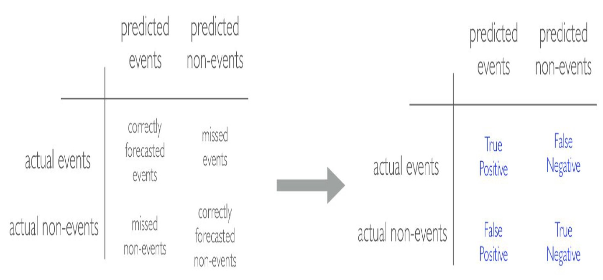

---
output:
  html_document: default
  pdf_document: default
---
# Lecture 19 {-}

&nbsp;

## Resampling Methods {-}

There are several steps to creating a useful model, including parameter estimation, model selection and tuning, and performance assessment. At the start of a new project, there is usually an initial finite pool of data available for all these tasks, which we can think of as an available data budget. How should the data be applied to different steps or tasks? The idea of **data spending** is an important first consideration when modeling, especially as it relates to empirical validation.

Approaching model-building process correctly means approaching it strategically by spending our data wisely on learning and validation procedures, properly pre-processing the feature and target variables, minimizing _data leakage_, tuning hyperparameters, and assessing model performance. 

In this lecture we will discuss basics of **data splitting**.

&nbsp;

### Data Splitting {-}

A major goal of any model-building process is to find an algorithm that most accurately predicts future values of the response variable _Y_ based on a set of predictor variables _Xs_.  In other words, we want an algorithm that not only fits well to our past data, but more importantly, one that predicts a future outcome accurately. This is called the **generalizability** of our algorithm. How we “spend” our data will help us understand how well our algorithm generalizes to unseen data.

To provide an accurate understanding of the generalizability of our final optimal model, we can split our data into training and test data sets:

* **Training set**: this data is used to develop feature sets, train our algorithms, tune hyperparameters, compare models, and all of the other activities required to choose a final model (e.g., the model we want to put into production).

* **Test set**: having chosen a final model, this data is used to estimate an unbiased assessment of the model’s performance, which we refer to as the _generalization error_.

Note: it is critical that the test set not be used prior to selecting your final model. Assessing results on the test set prior to final model selection biases the model selection process since the testing data will have become part of the model development process.

Given a fixed amount of data, typical recommendations for splitting your data into training-test splits include 60\% (training)–40\% (testing), 70\%–30\%, or 80\%–20\%. Generally speaking, these are appropriate guidelines to follow; however, it is good to keep the following points in mind:

* Spending too much in training (e.g., >80\%) won’t allow us to get a good assessment of predictive performance. We may find a model that fits the training data very well, but is not generalizable (**overfitting**).

* Sometimes too much spent in testing ( >40\%) won’t allow us to get a good assessment of model parameters (**underfitting**).

The two most common ways of splitting data include **Simple Random Sampling** and **Stratified Sampling** (both methods were discussed in **Lecture 18**). 

Sometimes imbalanced data can have a significant impact on model predictions and performance. Most often this involves classification problems where one class has a very small proportion of observations (e.g., defaults - 5% versus nondefaults - 95%). Several sampling methods have been developed to help remedy class imbalance and most of them can be categorized as either **up-sampling** or **down-sampling**.

**Down-sampling** balances the dataset by reducing the size of the abundant class(es) to match the frequencies in the least prevalent class. This method is used when the quantity of data is sufficient. By keeping all samples in the rare class and randomly selecting an equal number of samples in the abundant class, a balanced new dataset can be retrieved for further modeling. Furthermore, the reduced sample size reduces the computation burden imposed by further steps in the model-building process.

On the contrary, **up-sampling** is used when the quantity of data is insufficient. It tries to balance the dataset by increasing the size of rarer samples. Rather than getting rid of abundant samples, new rare samples are generated by using repetition or bootstrapping (discussed later). Note that there is no absolute advantage of one sampling method over another. Application of these two methods depends on the use case it applies to and the data set itself.

***

So far we've discussed splitting our data into training and testing sets. Furthermore, we were very explicit about the fact that we **do not** use the test set to assess model performance during the training phase. So how do we assess the generalization performance of the model?

**Solution 1:** Assess the model performance based on the training data. Disadvantages - this leads to biased results as some models can perform very well on the training data but not generalize well to a new data set (overfitting).

**Solution 2:** Use a validation approach, which involves splitting the training set further to create two parts: a training set and a **validation set** (a.k.a. **holdout set**). Disadvantages - validation using a single holdout set can be highly variable and unreliable unless you are working with very large data sets.

**Solution 3:** Resampling methods. They allow to repeatedly fit a model to parts of the training data and test its performance on other parts. The two commonly used resampling methods include **k-fold cross validation** and **bootstrapping**.

&nbsp;

#### k-fold cross validation {-}

k-fold cross-validation (aka k-fold CV) is a resampling method that randomly divides the training data into _k_ groups (aka folds) of approximately equal size. The model is fit on _k-1_ folds and then the remaining fold is used to compute model performance.

This procedure is repeated _k_ times; each time, a different fold is treated as the validation set. This process results in _k_ estimates of the generalization error. Thus, the k-fold CV estimate is computed by averaging the _k_ test errors, providing us with an approximation of the error we might expect on unseen data.

Consequently, with k-fold CV, every observation in the training data will be held out one time to be included in the test set as illustrated in the figure above. In practice, one typically uses **k = 5** or **k = 10**. There is no formal rule as to the size of _k_; however, as _k_ gets larger, the difference between the estimated performance and the true performance to be seen on the test set will decrease. On the other hand, using too large _k_ can introduce computational burdens

One special variation of cross-validation is **Leave-One-Out (LOO) Cross-Validation**. If there are _n_ training set samples, _n_ models (_n_ folds) are fit using _n − 1_ observations from the training set. Each model predicts the single excluded data point. At the end of resampling, the _n_ predictions are pooled to produce a single performance statistic.

Leave-one-out methods are deficient compared to almost any other method. For anything but pathologically small samples, LOO is computationally excessive, and it may not have good statistical properties.

&nbsp;

#### Bootstrapping {-}

A bootstrap sample is a random sample of the data taken with replacement. This means that, after a data point is selected for inclusion in the subset, it’s still available for further selection. A bootstrap sample is the same size as the original data set from which it was constructed.

The figure below provides a schematic of bootstrap sampling where each bootstrap sample contains 12 observations just as in the original data set. Furthermore, bootstrap sampling will contain approximately the same distribution of values (represented by colors) as the original data set.

Since samples are drawn with replacement, each bootstrap sample is likely to contain duplicate values. In fact, on average, approximately 63.21\% of the original sample ends up in any particular bootstrap sample. The original observations not contained in a particular bootstrap sample are considered **out-of-bag (OOB)**. When bootstrapping, a model can be built on the selected samples and validated on the OOB samples.

&nbsp;

### Model Evaluation {-}

Today, it has become widely accepted that a more sound approach to assessing model performance is to assess the predictive accuracy via **loss functions**. Loss functions are metrics that compare the predicted values to the actual value. When performing resampling methods, we assess the predicted values for a validation set compared to the actual target value.

For example, in regression, one way to measure error is to take the difference between the actual and predicted value for a given observation (this is the usual definition of a residual in ordinary linear regression). The overall validation error of the model is computed by aggregating the errors across the entire validation data set.

There are many loss functions to choose from when assessing the performance of a predictive model, each providing a unique understanding of the predictive accuracy and differing between regression and classification models. Furthermore, the way a loss function is computed will tend to emphasize certain types of errors over others and can lead to drastic differences in how we interpret the “optimal model”.

Its important to consider the problem context when identifying the preferred performance metric to use. And when comparing multiple models, we need to compare them across the same metric.

Depending on the problem context, we can divide them into two groups: **Regression** and **Classification** problems.

&nbsp;

#### Regression Metrics {-}

* **MSE - Mean Square Error:** Mean squared error is the average of the squared error ($MSE = \frac{\sum_{i=1}^{n}(y_i - \hat{y_i})^2}{n}$). The squared component results in larger errors having larger penalties. This (along with RMSE) is the most common error metric to use. **Objective: minimize**

* **RMSE - Root Mean Square Root:** Root mean squared error. This simply takes the square root of the MSE metric ($RMSE =\sqrt{ \frac{\sum_{i=1}^{n}(y_i - \hat{y_i})^2}{n}}$)  so that your error is in the same units as your response variable. If your response variable units are dollars, the units of MSE are dollars-squared, but the RMSE will be in dollars. **Objective: minimize**

* **$R^2$:** This is a popular metric that represents the proportion of the variance in the dependent variable that is predictable from the independent variable(s). Unfortunately, it has several limitations. For example, two models built from two different data sets could have the exact same RMSE but if one has less variability in the response variable then it would have a lower $R^2$ than the other. You should not place too much emphasis on this metric. **Objective: maximize**

&nbsp;

#### Classification Metrics {-}

Before we discuss evaluation metrics for classification problems, I would like to introduce a **confusion matrix**. In the field of statistics and machine learning, a confusion matrix is a table that visualizes the performance of a model. Each row of the confusion matrix represents the instances in an actual class while each column represents the instances in a predicted class, or vice versa (both variants are accepted and found in the literature).

It is a special kind of contingency table, with two dimensions ("actual" and "predicted"), and identical sets of "classes" in both dimensions (each combination of dimension and class is a variable in the contingency table):

* **Accuracy:** accuracy tells you, overall, how often the classifier is correct.

&nbsp;

\begin{align*}
Accuracy = \frac{TP + TN}{Total}
\end{align*}

&nbsp;

* **Sensitivity (aka Recall):** sensitivity tells you how accurately the classifier classifies actual events.

&nbsp;

\begin{align*}
Sensitivity = \frac{TP}{TP + FN}
\end{align*}

&nbsp;

* **Specificity:** specificity tells you how accurately the classifier classifies actual non-events.

&nbsp;

\begin{align*}
Specificity = \frac{TN}{FP + TN}
\end{align*}

&nbsp;

* **Precision:** precision tells you how accurately the classifier predicts actual events.

&nbsp;

\begin{align*}
Precision = \frac{TP}{TP + FP}
\end{align*}

&nbsp;
